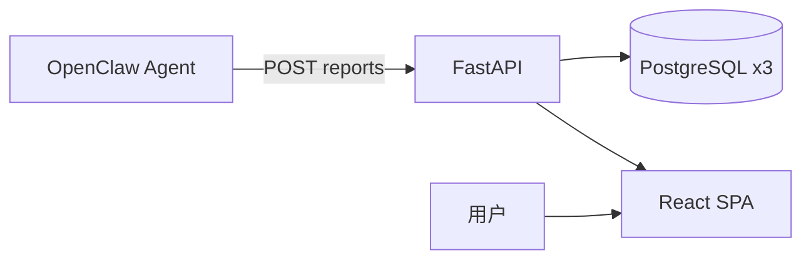

# OpenClaw News Publisher

接收 OpenClaw Agent 结构化新闻分析，完成入站校验、幂等落盘、渲染发布，并通过现代化 Web 界面展示市场研判。

## 架构



详见 [docs/human/architecture/overview.md](docs/human/architecture/overview.md)。

## 功能

| 模块 | 说明 |
|------|------|
| 报告入站 | 校验 JSON、幂等、异步渲染、可选 Git 发布 |
| 专题分析 | 情绪/风险/AI 结论/时间线 Dashboard |
| 价格监测 | OpenClaw 外采入库，时序图表展示 |
| 新闻库 | 关键词新闻沉淀与浏览 |
| 工作流 | 监测创建、联合分析、系统诊断 |
| 多用户门户 | 注册/登录、JWT、per-user API Key、数据隔离 |
| OpenClaw 对话 | 门户 WebSocket 聊天（需 Gateway）；**USER/ADMIN 分 Agent 隔离**；后台生成 + 轮询恢复 |

完整 API 见 [docs/human/api/openclaw-intake.md](docs/human/api/openclaw-intake.md) 与 `/docs`（Swagger）。

## 技术栈

- **后端**：Python 3.11+ / FastAPI / Pydantic / psycopg
- **前端**：React 18 / TypeScript / Vite / Tailwind CSS
- **数据库**：PostgreSQL × 3（reports / monitoring / news）
- **OpenClaw 运行时**：`skills/` Skill 包（Gateway `extraDirs` 权威路径）

## 30 分钟快速启动

```bash
# 1. 克隆并安装
git clone <repo> && cd openclaw_news_publisher
python3 -m venv .venv && source .venv/bin/activate
pip install -e ".[dev]"

# 2. 配置环境
cp .env.example .env
# 编辑三库 DSN（见 docs/human/deployment/local.md）

# 3. 验证数据库
bash scripts/local/verify-openclaw-databases.sh

# 4. 启动（开发双进程）
uvicorn app.main:app --reload --port 8000          # 终端 1
cd frontend && npm install && npm run dev            # 终端 2 → :5173

# 5. 首次登录
# 浏览器打开 http://localhost:5173/register 或 /login
# bootstrap ADMIN：admin@localhost / Test_648.（首次启动自动创建，生产请尽快修改）
# Agent 用 API Key：登录后进入 /account 生成 per-user Key

# 6. 测试
pytest -q
open http://localhost:5173
```

生产单体部署：`cd frontend && npm run build && uvicorn app.main:app --port 8000`

- **首次部署（1 小时）**：[docs/human/deployment/getting-started.md](docs/human/deployment/getting-started.md)
- 本地开发：[docs/human/deployment/local.md](docs/human/deployment/local.md)
- 服务器 / 生产：[docs/human/deployment/production.md](docs/human/deployment/production.md)
- **Android 内测 APK**：[docs/human/mobile/android-app.md](docs/human/mobile/android-app.md)（`apk-test` 分支）
- **OpenClaw Skills 挂载 Gateway**：[docs/human/deployment/openclaw-skills-gateway.md](docs/human/deployment/openclaw-skills-gateway.md)

## 环境变量

| 变量 | 说明 |
|------|------|
| `OPENCLAW_JWT_SECRET` | JWT 签名密钥（生产 ≥32 字符） |
| `OPENCLAW_LEGACY_API_KEY_ENABLED` | 全局 Key 过渡开关（**默认 false**） |
| `OPENCLAW_OPENCLAW_API_KEY` | 仅 Legacy 开启时作 ADMIN 映射；生产 fail-fast 仍校验强度 |
| `OPENCLAW_DATABASE_URL` | 报告主库（含 `users` 表） |
| `OPENCLAW_MONITORING_DATABASE_URL` | 价格监测库 |
| `OPENCLAW_NEWS_DATABASE_URL` | 新闻库 |
| `OPENCLAW_OPENCLAW_WS_URL` | OpenClaw Gateway WebSocket |
| `OPENCLAW_CHAT_RECV_TIMEOUT_SECONDS` | 对话单轮 Gateway 空闲超时（秒，默认 120） |
| `OPENCLAW_CHAT_TOTAL_TIMEOUT_SECONDS` | 对话单轮总时长上限（秒，默认 600） |
| `OPENCLAW_WS_MESSAGES_PER_MINUTE` | 门户聊天 WS 发消息限速（默认 12/分钟） |
| `OPENCLAW_CHAT_USER_MESSAGES_PER_MINUTE` | 每用户跨连接聊天限速（默认 30/分钟） |
| `OPENCLAW_GATEWAY_STATE_DIR` | ADMIN 门户聊天 Gateway device 目录 |
| `OPENCLAW_GATEWAY_PORTAL_STATE_DIR` | USER 受限 Gateway device 目录（**生产必填**） |
| `OPENCLAW_GATEWAY_PORTAL_AGENT_ID` | USER 路由 Agent（默认 `portal-readonly`） |
| `OPENCLAW_GATEWAY_ADMIN_AGENT_ID` | ADMIN 路由 Agent（默认 `main`） |
| `OPENCLAW_CHAT_ENABLED_FOR_USER` | USER 是否可门户聊天（默认 true） |
| `OPENCLAW_SERVE_SPA` | 是否挂载前端静态资源（默认 true） |

Gateway 权限隔离详见 [docs/human/security/gateway-isolation.md](docs/human/security/gateway-isolation.md)。

## 目录结构

```text
app/           # FastAPI 后端
frontend/      # React SPA
docs/          # human / openclaw / reports / archive
scripts/       # 一键部署与本地脚本
tests/         # pytest
skills/        # OpenClaw Gateway 运行时 Skill（权威路径）
```

## 文档入口

**30 分钟 onboarding**：[docs/project-brain/PROJECT_MAP.md](docs/project-brain/PROJECT_MAP.md)

**完整文档地图**：[docs/PROJECT_DOCUMENT_INDEX.md](docs/PROJECT_DOCUMENT_INDEX.md)

| 受众 | 入口 |
|------|------|
| 新加入工程师 | [docs/project-brain/](docs/project-brain/README.md) → [human/README.md](docs/human/README.md) |
| 人类工程师 | [docs/human/README.md](docs/human/README.md) |
| OpenClaw 运行时 | [docs/openclaw/README.md](docs/openclaw/README.md) → `skills/` |
| Cursor 开发辅助 | [docs/AGENT_DOCUMENTATION_RULES.md](docs/AGENT_DOCUMENTATION_RULES.md) |

## 测试

```bash
pytest -q
```

## 本地脚本

| 脚本 | 用途 |
|------|------|
| `scripts/local/start-server.sh` | 后台启动 uvicorn |
| `scripts/local/stop-server.sh` | 停止服务 |
| `scripts/local/verify-openclaw-databases.sh` | 三库连通性检查 |
| `scripts/local/cleanup.sh` | 安全清理缓存与临时文件（`--apply` 执行删除） |
| `scripts/deploy/one-click-docker.sh` | Docker 一键部署（应用 + PostgreSQL） |
| `scripts/deploy/one-click-linux.sh` | Linux 裸机一键部署（不含 PostgreSQL） |

## License

内部项目 — 按组织规范使用。
