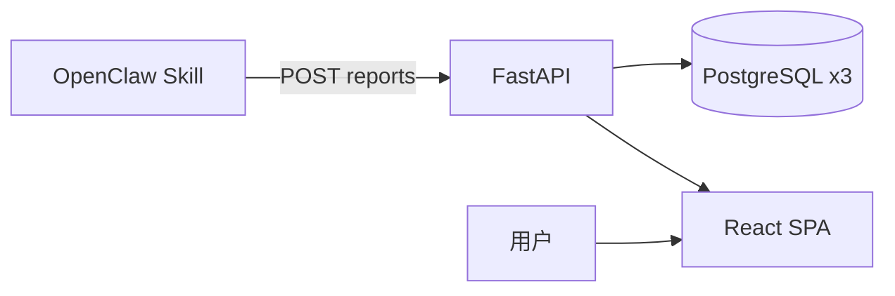

# OpenClaw News Publisher

接收 OpenClaw Agent 结构化新闻分析，完成入站校验、幂等落盘、渲染发布，并通过现代化 Web 界面展示市场研判。

## 架构



详见 [docs/architecture.md](docs/architecture.md)。

## 功能

| 模块 | 说明 |
|------|------|
| 报告入站 | 校验 JSON、幂等、异步渲染、可选 Git 发布 |
| 专题分析 | 情绪/风险/AI 结论/时间线 Dashboard |
| 价格监测 | OpenClaw 外采入库，时序图表展示 |
| 新闻库 | 关键词新闻沉淀与浏览 |
| 工作流 | 监测创建、联合分析、系统诊断 |
| 多用户门户 | 注册/登录、JWT、per-user API Key、数据隔离 |
| OpenClaw 对话 | 门户 WebSocket 聊天（需 Gateway）；违规词过滤 |

完整 API 见 [docs/api/openclaw-intake.md](docs/api/openclaw-intake.md) 与 `/docs`（Swagger）。

## 技术栈

- **后端**：Python 3.11+ / FastAPI / Pydantic / psycopg
- **前端**：React 18 / TypeScript / Vite / Tailwind CSS
- **数据库**：PostgreSQL × 3（reports / monitoring / news）
- **Agent**：`skills/` OpenClaw 技能包（Cursor 经 `.cursor/skills` 符号链接）

## 30 分钟快速启动

```bash
# 1. 克隆并安装
git clone <repo> && cd openclaw_news_publisher
python3 -m venv .venv && source .venv/bin/activate
pip install -e ".[dev]"

# 2. 配置环境
cp .env.example .env
# 编辑三库 DSN（见 docs/deployment.md）

# 3. 验证数据库
bash scripts/local/verify-openclaw-databases.sh

# 4. 启动（开发双进程）
uvicorn app.main:app --reload --port 8000          # 终端 1
cd frontend && npm install && npm run dev            # 终端 2 → :5173

# 5. 首次登录
# 浏览器打开 http://localhost:5173/register 或 /login
# bootstrap ADMIN：admin@localhost / Test_648.（首次启动自动创建，生产请尽快修改）
# Agent 用 API Key：登录后进入 /account 生成 per-user Key

# 6. 测试
pytest -q
open http://localhost:5173
```

生产单体部署：`cd frontend && npm run build && uvicorn app.main:app --port 8000`

- 本地开发：[docs/deployment.md](docs/deployment.md)
- 服务器 / 生产：[docs/server-deployment.md](docs/server-deployment.md)
- **OpenClaw Skills 挂载 Gateway**：[docs/openclaw-skills-deploy.md](docs/openclaw-skills-deploy.md)

## 环境变量

| 变量 | 说明 |
|------|------|
| `OPENCLAW_JWT_SECRET` | JWT 签名密钥（生产 ≥32 字符） |
| `OPENCLAW_LEGACY_API_KEY_ENABLED` | 全局 Key 过渡开关（**默认 false**） |
| `OPENCLAW_OPENCLAW_API_KEY` | 仅 Legacy 开启时作 ADMIN 映射；生产 fail-fast 仍校验强度 |
| `OPENCLAW_DATABASE_URL` | 报告主库（含 `users` 表） |
| `OPENCLAW_MONITORING_DATABASE_URL` | 价格监测库 |
| `OPENCLAW_NEWS_DATABASE_URL` | 新闻库 |
| `OPENCLAW_OPENCLAW_WS_URL` | OpenClaw Gateway WebSocket |
| `OPENCLAW_SERVE_SPA` | 是否挂载前端静态资源（默认 true） |

完整列表：[`.env.example`](.env.example)

## 目录结构

```text
app/           # FastAPI 后端
frontend/      # React SPA
docs/          # 架构、部署、开发文档
scripts/       # 一键部署与本地脚本
tests/         # pytest
skills/           # Agent 技能（权威路径）
.cursor/skills -> skills/  # Cursor IDE 符号链接
```

## 文档地图

| 文档 | 内容 |
|------|------|
| [docs/architecture.md](docs/architecture.md) | 系统架构、数据流、三库 |
| [docs/deployment.md](docs/deployment.md) | 本地开发与快速验证 |
| [docs/server-deployment.md](docs/server-deployment.md) | 服务器 / Docker / Nginx / systemd 生产部署 |
| [docs/developer-guide.md](docs/developer-guide.md) | 模块说明、开发规范 |
| [docs/api/openclaw-intake.md](docs/api/openclaw-intake.md) | API 契约 |
| [docs/multi-user/MULTI_USER_MIGRATION_PLAN.md](docs/multi-user/MULTI_USER_MIGRATION_PLAN.md) | 多用户 SaaS 迁移与实施状态 |
| [docs/multi-user/MULTI_USER_TEST_PLAN.md](docs/multi-user/MULTI_USER_TEST_PLAN.md) | 多用户测试计划 |
| [docs/cross-platform-development.md](docs/cross-platform-development.md) | Win/Ubuntu 协作 |
| [skills/README.md](skills/README.md) | Agent Skill 包说明与路径约定 |
| [docs/openclaw-skills-deploy.md](docs/openclaw-skills-deploy.md) | Gateway 挂载 `skills/`、API Key |

## 测试

```bash
pytest -q
```

## 本地脚本

| 脚本 | 用途 |
|------|------|
| `scripts/local/start-server.sh` | 后台启动 uvicorn |
| `scripts/local/stop-server.sh` | 停止服务 |
| `scripts/local/verify-openclaw-databases.sh` | 三库连通性检查 |
| `scripts/deploy/one-click-docker.sh` | Docker 一键部署（应用 + PostgreSQL） |
| `scripts/deploy/one-click-linux.sh` | Linux 裸机一键部署（不含 PostgreSQL） |

## License

内部项目 — 按组织规范使用。
