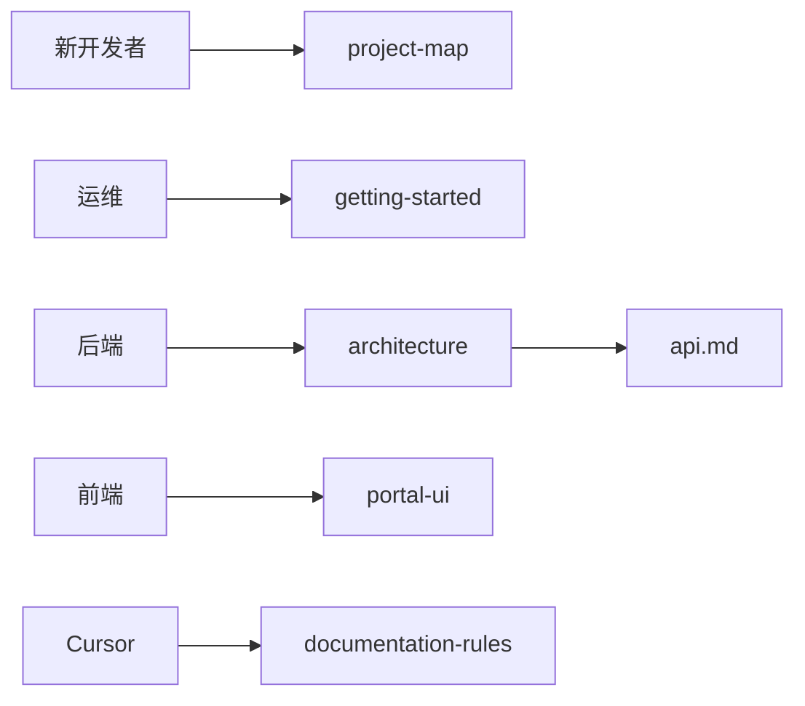

# 文档索引

> 新开发者 5 分钟路径：**[project-map](project-map.md) → [architecture](architecture.md) → [local-dev](../01-getting-started/local-dev.md)**

## 做什么

人类工程师的统一文档入口；按编号目录组织，与 `_agent/`（Agent 专用）分离。

## 关键组件

| 目录 | 职责 |
|------|------|
| `00-overview/` | 项目地图、架构、路线图、ADR |
| `01-getting-started/` | 部署与 Gateway |
| `02-backend/` | API、系统设计、Gateway 隔离 |
| `03-frontend/` | 门户 UI、Android |
| `04-product/` | 对话、Token 计费 |
| `05-dev/` | 开发规范、测试、技术债 |
| `_agent/` | Cursor / OpenClaw 运行时规则 |

## 数据流（按角色选入口）

## 示例

| 我要… | 打开 |
|-------|------|
| 5 分钟懂仓库 | [project-map.md](project-map.md) |
| 看系统全貌 | [architecture.md](architecture.md) |
| 改 API | [../02-backend/api.md](../02-backend/api.md) |
| 首次部署 | [../01-getting-started/getting-started.md](../01-getting-started/getting-started.md) |
