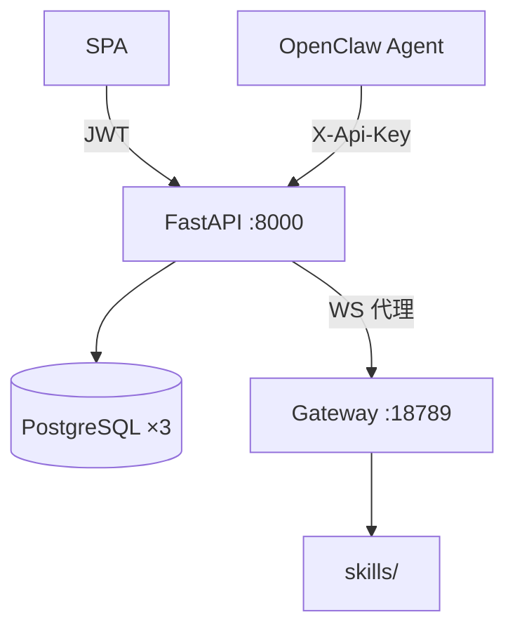
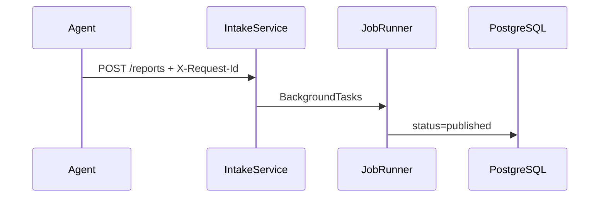

# 系统架构

> 多用户 SaaS 市场分析门户：FastAPI 入站 + 三库 + React SPA；可选 WebSocket 代理 OpenClaw Gateway。

## 做什么

定义系统边界：谁调用谁、数据存哪里、API 如何分层。

## 关键组件



| 层 | 路径 | 鉴权 |
|----|------|------|
| Agent API | `/api/v1/openclaw/*` | per-user `X-Api-Key` |
| 门户 API | `/api/v1/public/*` | JWT / Key |
| 认证 | `/api/v1/auth/*` | JWT / Cookie |
| 对话 | `/api/v1/chat/*` | JWT / Cookie / Key |

| 数据库 | 环境变量 | 核心表 |
|--------|----------|--------|
| openclaw_app | `OPENCLAW_DATABASE_URL` | `reports`, `users`, `token_usage` |
| openclaw_monitor | `OPENCLAW_MONITORING_DATABASE_URL` | `price_monitors`, `price_observations` |
| openclaw_news | `OPENCLAW_NEWS_DATABASE_URL` | `news_library` |

| 代码入口 | 职责 |
|----------|------|
| `app/main.py` | 应用工厂、SPA 挂载 |
| `app/api/v1/openclaw.py` | Agent 入站 |
| `app/api/v1/public.py` | 门户 REST |
| `app/services/intake_service.py` | 报告幂等入站 |
| `app/workers/job_runner.py` | 异步渲染 |

**多用户隔离**：`QueryContext(user_id, role)`；跨用户资源 ID → **404**。

## 数据流

### 报告入站



### 门户对话

SPA → `WSS /chat/ws` → FastAPI 按角色选 Agent → Gateway → 流式回传；`chat_run_store` 内存保留 run。

## 示例

```bash
# Agent 提交报告（需 per-user Key）
curl -X POST http://localhost:8000/api/v1/openclaw/reports \
  -H "X-Api-Key: $KEY" -H "X-Request-Id: $(uuidgen)" \
  -H "Content-Type: application/json" \
  -d '{"task_id":"t1","keyword":"demo","items":[],"analysis":"..."}'

# SPA 读报告
curl http://localhost:8000/api/v1/public/reports -H "Authorization: Bearer $JWT"
```

| 深入 | 文档 |
|------|------|
| 后端设计 | [../02-backend/system-design.md](../02-backend/system-design.md) |
| API 契约 | [../02-backend/api.md](../02-backend/api.md) |
| 计费 | [../04-product/billing.md](../04-product/billing.md) |
