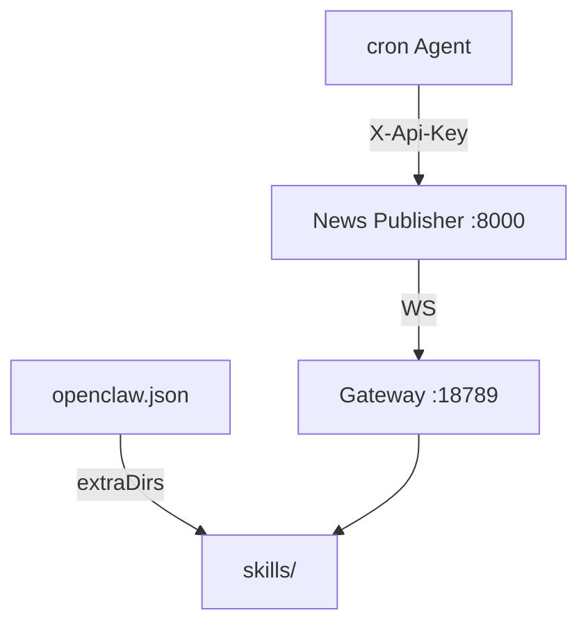

# OpenClaw Gateway 挂载

> Skill 包 2.0.1 · 权威路径仓库根 `skills/` · Gateway `extraDirs`。

## 做什么

把 `skills/` 挂载到 OpenClaw Gateway，使 cron/外采 Agent 能读取 SKILL.md 并调用 News Publisher API。

## 关键组件



| 组件 | 位置 | 说明 |
|------|------|------|
| Skill 根 | `<repo>/skills/` | Git 跟踪，Gateway 读取 |
| Gateway 配置 | `~/.openclaw/openclaw.json` | `skills.load.extraDirs` |
| API | News Publisher `:8000` | Agent 用 per-user Key |
| WS | `OPENCLAW_OPENCLAW_WS_URL` | 门户对话代理 |

| 生产 Skill（8 个） | 职责 |
|-------------------|------|
| conversational-assistant | 对话入口、路由 |
| report-security | 发布前五项安全门 |
| news-publisher-enhanced | 爬虫 + 入站 |
| price-ingest-external | 外采价格 |
| price-analysis-reporting | 联合分析 |
| public-news-library | 新闻库 |
| user-workspace | 只读聚合 |
| audit-events | 审计（预埋） |

## 数据流

```
Gateway 启动 → 读 extraDirs/skills → 加载 SKILL.md
    → Agent 按 Skill 指令 → HTTP X-Api-Key → News Publisher API
        → 报告/监测/新闻写入三库 → SPA 展示
```

## 示例

### `openclaw.json` 片段

```json
{
  "skills": {
    "load": {
      "extraDirs": ["/opt/openclaw_news_publisher/skills"]
    }
  }
}
```

### Agent 调用 API

```bash
# 门户 /account 生成 Key 后
export KEY="oc_..."
export BASE="http://127.0.0.1:8000/api/v1"

curl -H "X-Api-Key: $KEY" "$BASE/public/reports"
curl -X POST -H "X-Api-Key: $KEY" -H "X-Request-Id: $(uuidgen)" \
  "$BASE/openclaw/reports" -d @report.json
```

更新 Skill 后：Gateway 重载或重启 → 验证 `GET /healthz` + 试调一条 ingest。

| Skill 矩阵 | [../_agent/skill-map.md](../_agent/skill-map.md) |
| 隔离 P0 | [../02-backend/gateway-isolation.md](../02-backend/gateway-isolation.md) |
