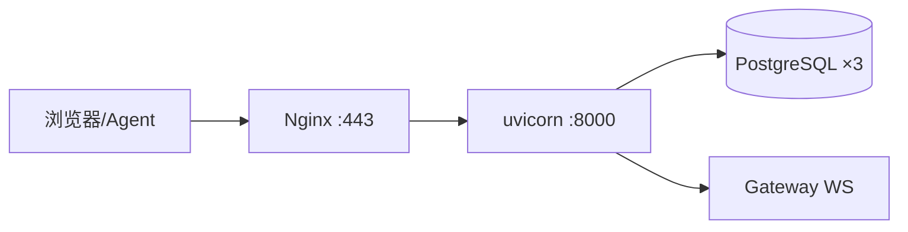

# 生产部署

> Linux 云主机单体部署：FastAPI 挂载 SPA + Nginx TLS。本地开发见 [local-dev.md](local-dev.md)。

## 做什么

在云服务器上稳定运行门户与 Agent API，含 Docker/systemd/Nginx 三种形态。

## 关键组件



| 方式 | 入口 | 适用 |
|------|------|------|
| Docker | `scripts/deploy/one-click-docker.sh` | 快速上线 |
| systemd | `deploy.sh` | 裸机编排 |
| 手动 | pip + npm build + uvicorn | 自定义 |

| 生产 Checklist | |
|----------------|--|
| `OPENCLAW_PRODUCTION=true` | |
| `OPENCLAW_PAYMENTS_SIMULATED_CONFIRM_ENABLED=false` | |
| `OPENCLAW_SUBSCRIPTIONS_SIMULATED_UPGRADE_ENABLED=false` | |
| `OPENCLAW_JWT_SECRET` ≥32 字符 | |
| Gateway 双 Agent + 防火墙 18789 | [gateway-isolation](../02-backend/gateway-isolation.md) |
| Nginx WebSocket 升级 | `proxy_set_header Upgrade` |

## 数据流

```
git pull → frontend npm run build → uvicorn 挂载 dist
    → Nginx 443 反代 → 用户 HTTPS 访问
        → Agent HTTPS + X-Api-Key → /openclaw/*
```

## 示例

### Docker

```bash
git clone <repo> /opt/openclaw_news_publisher && cd $_
bash scripts/deploy/one-click-docker.sh
```

### 裸机更新

```bash
bash deploy.sh              # git pull + build + 重启
bash deploy.sh --docker     # Docker 模式
```

### Nginx WebSocket 片段

```nginx
location /api/v1/chat/ws {
    proxy_pass http://127.0.0.1:8000;
    proxy_http_version 1.1;
    proxy_set_header Upgrade $http_upgrade;
    proxy_set_header Connection "upgrade";
}
```

| 首次部署 | [getting-started.md](getting-started.md) |
| Android APK | [../03-frontend/android-app.md](../03-frontend/android-app.md)（本机构建，非云机） |
