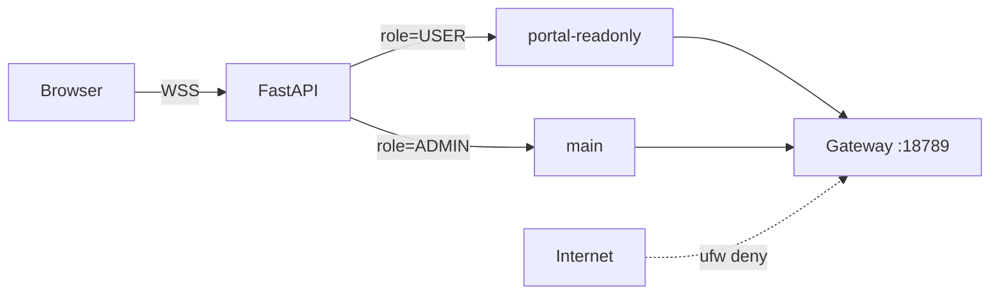

# Gateway 隔离

> **P0**：门户 USER 不得获得 Gateway 管理员能力。

## 做什么

防止门户聊天 WebSocket 代理把**单一 admin device** 暴露给所有登录用户，导致 USER 可读写宿主机、执行命令。

## 关键组件

| 组件 | 配置 |
|------|------|
| USER Agent | `OPENCLAW_GATEWAY_PORTAL_AGENT_ID`（默认 `portal-readonly`） |
| ADMIN Agent | `OPENCLAW_GATEWAY_ADMIN_AGENT_ID`（默认 `main`） |
| USER device 目录 | `OPENCLAW_GATEWAY_PORTAL_STATE_DIR`（**生产必填**） |
| ADMIN device 目录 | `OPENCLAW_GATEWAY_STATE_DIR` |
| 权限白名单 | `GatewayPermissionChecker` |
| 审计 | `gateway_audit_events` 表 |

| 网络 | 规则 |
|------|------|
| Gateway | 宿主机 `:18789`，**不对公网** |
| FastAPI | Nginx 反代 `:443` → `:8000` |
| Docker | 不 publish 18789；`ws://host.docker.internal:18789/ws` |

## 数据流



```
用户发消息 → chat.py 解析 JWT role → 选 device/agent → 转发 Gateway → 审计落库
```

## 示例

### 生产防火墙

```bash
sudo ufw deny 18789/tcp
sudo ufw allow 443/tcp && sudo ufw enable
```

### `.env` 片段

```env
OPENCLAW_OPENCLAW_WS_URL=ws://host.docker.internal:18789/ws
OPENCLAW_GATEWAY_PORTAL_STATE_DIR=/var/lib/openclaw/portal-device
OPENCLAW_GATEWAY_STATE_DIR=/var/lib/openclaw/admin-device
OPENCLAW_GATEWAY_PORTAL_AGENT_ID=portal-readonly
OPENCLAW_GATEWAY_ADMIN_AGENT_ID=main
```

| 相关 | 文档 |
|------|------|
| Gateway 挂载 | [../01-getting-started/openclaw-gateway.md](../01-getting-started/openclaw-gateway.md) |
| 门户对话 | [../04-product/portal-chat.md](../04-product/portal-chat.md) |
