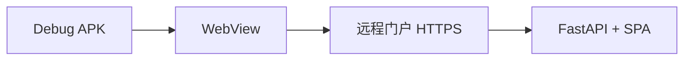

# Android 内测 APK

> Capacitor WebView 加载远程门户 · 分支 `apk-test` · **本机构建，勿在云服务器打包**。

## 做什么

生成 debug APK，在真机验证 WebView 加载门户、登录、对话与导航。

## 关键组件



| 项 | 值 |
|----|-----|
| 分支 | `apk-test` |
| appId | `com.openclaw.portal` |
| 远程 URL | `capacitor.config.ts` → `server.url` |
| 证书 | `res/raw/openclaw_server.crt`（自签内测） |

| 依赖 | 要求 |
|------|------|
| Node | 22+ |
| JDK | 17/21 完整版（含 javac） |
| Android SDK | API 36 + Build-Tools |

## 数据流

```
npm run build → cap sync android → gradlew assembleDebug
    → app-debug.apk → adb install → 手机 WebView 加载远程 SPA
        → wss:// 对话 / JWT 登录（与浏览器相同 API）
```

改网页内容一般**无需重装 APK**；换证书需更新 `openclaw_server.crt` 后重编。

## 示例

```bash
git checkout apk-test
cd frontend
npm install && npm run build
npx cap sync android
cd android && ./gradlew assembleDebug
adb install -r app/build/outputs/apk/debug/app-debug.apk
```

真机清单：登录 → 首页对话 → 报告列表 → ☰ 导航 → 🌙/☀️ 主题。

| Web 部署 | [../01-getting-started/production.md](../01-getting-started/production.md) |
