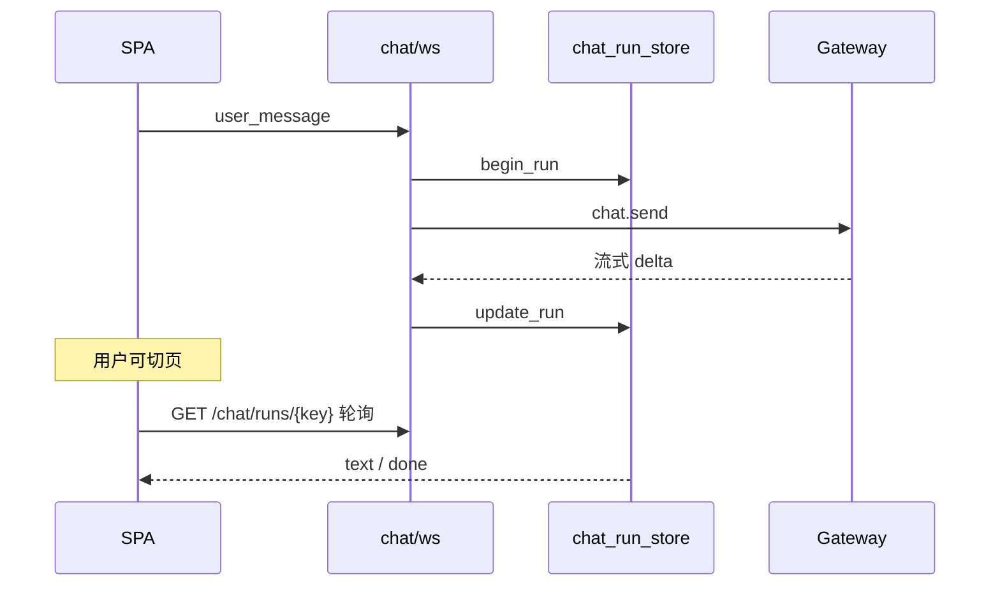

# 门户对话

> 首页 `/app` 经 WebSocket 代理 OpenClaw Gateway；切页不中断服务端生成。

## 做什么

让用户在 SPA 内与 OpenClaw 自然语言交互；后台 run 可轮询恢复，无需一直停在聊天页。

## 关键组件

| 层 | 路径 | 职责 |
|----|------|------|
| WebSocket | `app/api/v1/chat.py` | 鉴权、限速、派发 `chat.send` |
| 桥接 | `services/openclaw_chat_bridge.py` | 按 role 选 device/agent |
| 存储 | `services/chat_run_store.py` | 内存 run 状态（KI-004 待持久化） |
| 权限 | `services/gateway_permission_checker.py` | USER/ADMIN 白名单 |
| 前端 | `features/chat/ChatProvider.tsx` | 全站 WS + pending 轮询 |
| UI | `features/workspace/WorkspacePage.tsx` | 首页气泡 |
| 本地 | `features/chat/storage.ts` | localStorage 会话历史 |

| 限速 | 默认 |
|------|------|
| WS 消息 | 12/分钟/连接 |
| 用户跨连接 | 30/分钟 |

## 数据流



`sessionKey` 客户端 UUID；转发 Gateway 时前缀 `{agent_id}:{user_id}:{uuid}`。

## 示例

```bash
# 轮询恢复（Cookie 或 Bearer）
curl http://localhost:8000/api/v1/chat/runs/$SESSION_KEY \
  -H "Authorization: Bearer $JWT"
```

前端：`ChatProvider` 包裹 `AppShell`；pending 每 1.5s 轮询 `localStorage` 中的未完成 sessionKey。

| 安全 | [../02-backend/gateway-isolation.md](../02-backend/gateway-isolation.md) |
| Gateway 挂载 | [../01-getting-started/openclaw-gateway.md](../01-getting-started/openclaw-gateway.md) |
