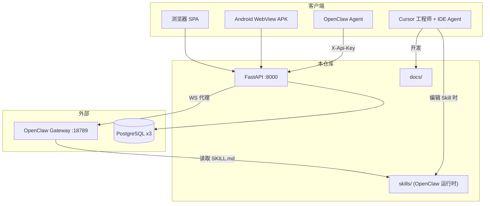

# OpenClaw News Publisher — 项目文档索引

**版本**：1.2  
**更新**：2026-06-08（治理文档已迁入 `docs/`）

**用途**：人类工程师、Cursor Agent、OpenClaw 运维的统一文档入口。

| 受众 | 入口 |
|------|------|
| 人类工程师 | 本文件 §2、§4；[human/README.md](human/README.md) |
| **Cursor Agent**（IDE 开发辅助） | [AGENT_DOCUMENTATION_RULES.md](AGENT_DOCUMENTATION_RULES.md) |
| **OpenClaw Agent**（Gateway 运行时） | 本文件 §3 → [openclaw/README.md](openclaw/README.md) → `skills/` |

---

## 快速导航

| 我是谁 | 从这里开始 |
|--------|------------|
| 新加入工程师 | [README.md](../README.md) → [human/deployment/local.md](human/deployment/local.md) → [human/development/developer-guide.md](human/development/developer-guide.md) |
| 运维 / 生产部署 | [human/deployment/production.md](human/deployment/production.md) → [human/security/gateway-isolation.md](human/security/gateway-isolation.md) |
| OpenClaw / Gateway 集成 | [human/deployment/openclaw-skills-gateway.md](human/deployment/openclaw-skills-gateway.md) → [../skills/README.md](../skills/README.md) |
| **Cursor Agent**（改本仓库） | [AGENT_DOCUMENTATION_RULES.md](AGENT_DOCUMENTATION_RULES.md) → [human/development/developer-guide.md](human/development/developer-guide.md) |
| **OpenClaw 运行时** | [openclaw/README.md](openclaw/README.md) → [../skills/_shared/agent-safety-baseline.md](../skills/_shared/agent-safety-baseline.md) |
| 安全审计溯源 | [reports/security/verification-report-v5-2026-06-05.md](reports/security/verification-report-v5-2026-06-05.md)（快照） |
| 文档治理（归档） | [archive/governance/](archive/governance/README.md) |

---

## 1. 项目地图

### 1.1 系统概览



### 1.2 代码目录

| 路径 | 职责 |
|------|------|
| `app/` | FastAPI 后端 |
| `frontend/` | React SPA；`frontend/android/`（`apk-test` 分支） |
| `skills/` | **OpenClaw Gateway 运行时 Skill**（`extraDirs`） |
| `docs/human/` | 人类工程师活跃文档 |
| `docs/openclaw/` | OpenClaw 运行时索引 |
| `docs/reports/` | 审计/验证快照 |
| `docs/archive/` | 已实施/已完成方案 |
| `tests/` | pytest（当前 **102** 项） |

### 1.3 文档目录

```
docs/
├── PROJECT_DOCUMENT_INDEX.md   # 本文件
├── AGENT_DOCUMENTATION_RULES.md
├── human/       # 部署、开发、API、运维
├── openclaw/    # OpenClaw 运行时导航
├── reports/     # 安全报告快照
└── archive/     # 历史方案 + governance/
```

---

## 2. 文档地图

### 2.1 人类活跃文档（`human/`）

| 文档 | 说明 |
|------|------|
| [architecture/overview.md](human/architecture/overview.md) | 三库架构、数据流 |
| [deployment/local.md](human/deployment/local.md) | 本地开发 |
| [deployment/production.md](human/deployment/production.md) | 生产部署 |
| [deployment/openclaw-skills-gateway.md](human/deployment/openclaw-skills-gateway.md) | Gateway 挂载 `skills/` |
| [development/developer-guide.md](human/development/developer-guide.md) | 开发规范 |
| [development/cross-platform.md](human/development/cross-platform.md) | Win/Ubuntu 协作 |
| [features/portal-chat.md](human/features/portal-chat.md) | 门户对话实现 |
| [mobile/android-app.md](human/mobile/android-app.md) | Capacitor APK |
| [api/openclaw-intake.md](human/api/openclaw-intake.md) | **API 契约权威** |
| [security/gateway-isolation.md](human/security/gateway-isolation.md) | **P0** Gateway 隔离 |
| [testing/multi-user-test-plan.md](human/testing/multi-user-test-plan.md) | 多用户测试 |

**兼容重定向**（旧书签）：[api/openclaw-intake.md](api/openclaw-intake.md)、[security/GATEWAY_ISOLATION.md](security/GATEWAY_ISOLATION.md)

### 2.2 报告与归档

| 文档 | 类型 |
|------|------|
| [reports/security/hardening-plan-2026-06-05.md](reports/security/hardening-plan-2026-06-05.md) | 快照 |
| [reports/security/verification-report-v5-2026-06-05.md](reports/security/verification-report-v5-2026-06-05.md) | 快照 |
| [archive/multi-user/migration-plan-2026-06-05.md](archive/multi-user/migration-plan-2026-06-05.md) | 已实施 |
| [archive/skills/skill-refactor-plan-2026-06-06.md](archive/skills/skill-refactor-plan-2026-06-06.md) | 已完成 |
| [archive/governance/](archive/governance/README.md) | 文档治理过程记录 |

### 2.3 治理文档（`docs/` 根）

| 文档 | 说明 |
|------|------|
| [AGENT_DOCUMENTATION_RULES.md](AGENT_DOCUMENTATION_RULES.md) | **Cursor** 读取规则 |
| [archive/governance/documentation-audit-2026-06-08.md](archive/governance/documentation-audit-2026-06-08.md) | 审计报告（归档） |
| [archive/governance/documentation-migration-plan-2026-06-08.md](archive/governance/documentation-migration-plan-2026-06-08.md) | 迁移计划（已执行） |

---

## 3. OpenClaw Skill 地图

> **受众**：OpenClaw Gateway 运行时。Cursor 仅在编辑 Skill 时参考。

索引：[openclaw/README.md](openclaw/README.md) · 阅读顺序：[openclaw/reading-order.md](openclaw/reading-order.md)

| Skill | 职责 |
|-------|------|
| [openclaw-conversational-assistant](../skills/openclaw-conversational-assistant/SKILL.md) | 对话入口、意图路由 |
| [openclaw-user-workspace](../skills/openclaw-user-workspace/SKILL.md) | 用户工作区 |
| [openclaw-price-ingest-external](../skills/openclaw-price-ingest-external/SKILL.md) | 外采价格 ingest |
| [openclaw-news-publisher-enhanced](../skills/openclaw-news-publisher-enhanced/SKILL.md) | 新闻爬虫 + 报告 |
| [openclaw-public-news-library](../skills/openclaw-public-news-library/SKILL.md) | 新闻库 |
| [openclaw-price-analysis-reporting](../skills/openclaw-price-analysis-reporting/SKILL.md) | 联合分析 |
| [openclaw-report-security](../skills/openclaw-report-security/SKILL.md) | 发布安全门 |
| [openclaw-audit-events](../skills/openclaw-audit-events/SKILL.md) | 审计事件 |

`_shared/` 策略见 [../skills/README.md](../skills/README.md)。

---

## 4. 部署地图

| 场景 | 文档 |
|------|------|
| 本地双进程 | [local.md](human/deployment/local.md) |
| Docker 一键 | [production.md](human/deployment/production.md) |
| Gateway + Skill | [openclaw-skills-gateway.md](human/deployment/openclaw-skills-gateway.md) |
| Android APK | [android-app.md](human/mobile/android-app.md) |

**P0 Checklist**：Gateway 双 Agent + 防火墙 18789 → [gateway-isolation.md](human/security/gateway-isolation.md)

---

*迁移记录见 [archive/governance/documentation-migration-plan-2026-06-08.md](archive/governance/documentation-migration-plan-2026-06-08.md)。*
