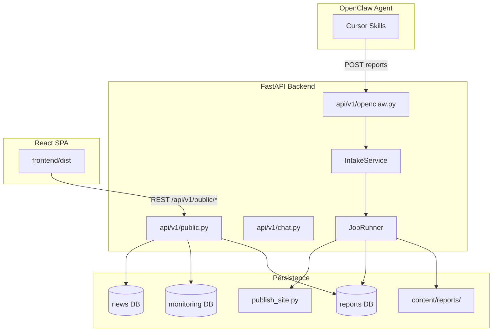
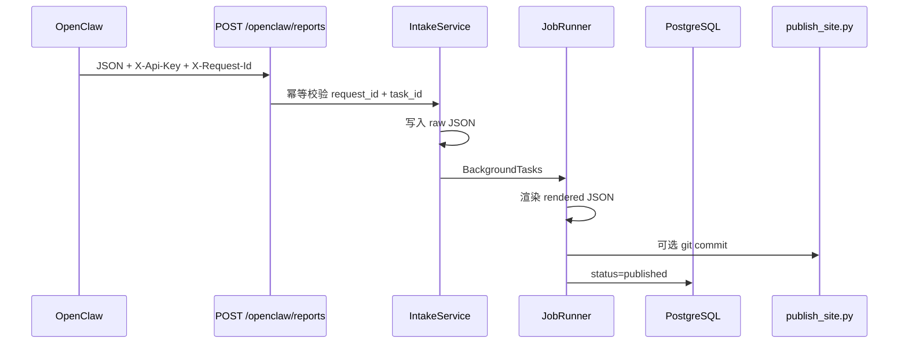

# 系统架构

## 概览

OpenClaw News Publisher 是一个 **FastAPI 后端 + React SPA 前端** 的市场分析平台，接收 OpenClaw Agent 生成的结构化报告，完成入站、渲染、发布与可视化展示。

## 三库架构

| 环境变量 | 数据库 | 核心表 | 自动建表 |
|----------|--------|--------|----------|
| `OPENCLAW_DATABASE_URL` | openclaw_app | `reports` | 需手动 DDL 或一键脚本 |
| `OPENCLAW_MONITORING_DATABASE_URL` | openclaw_monitor | `price_monitors`, `price_observations`, … | 首次 API 调用时 |
| `OPENCLAW_NEWS_DATABASE_URL` | openclaw_news | `news_library` | 首次写入时 |

未配置 `OPENCLAW_DATABASE_URL` 时，入站走内存模式；公开报告 API 返回 503。

## 报告数据流

## Agent 流程

1. Cursor Skill 抓取/整理新闻，生成符合 `OpenClawReportIn` schema 的 JSON
2. `POST /api/v1/openclaw/reports` 提交（必须带 `X-Request-Id`）
3. 轮询 `GET /api/v1/openclaw/reports/{ingest_id}` 直到 `published`
4. 前端 `GET /api/v1/public/reports` 读取并展示

可选结构化字段 `insights`（情绪、风险、置信度）用于 Dashboard 卡片。

## API 分层

| 前缀 | 鉴权 | 用途 |
|------|------|------|
| `/api/v1/openclaw/*` | `X-Api-Key` | Agent 入站、监测写入、新闻入库 |
| `/api/v1/public/*` | JWT / per-user Key | 前端 SPA 读取、工作流、账户 |
| `/api/v1/auth/*` | JWT / Cookie | 注册、登录、Refresh |
| `/api/v1/chat/ws` | JWT / Cookie / Key | OpenClaw Gateway 聊天 WebSocket |
| `/api/v1/chat/runs/*` | JWT / Cookie / Key | 对话后台任务状态轮询 |

## 门户对话

首页经 WebSocket 代理 OpenClaw Gateway；**USER 与 ADMIN 使用不同 Agent / device 凭证**（见 [security/GATEWAY_ISOLATION.md](security/GATEWAY_ISOLATION.md)）。每轮对话在服务端 **`chat_run_store`（内存）** 保留最新正文，客户端可通过 **`GET /chat/runs/{sessionKey}`** 恢复。

详见 [portal-chat.md](portal-chat.md)。

## Git 发布流程

1. `JobRunner` 渲染 `content/reports/rendered/{ingest_id}.json`
2. `PublishService` 调用 `scripts/publish_site.py`
3. 若路径被 gitignore 则 no-op；否则 `git add` + `git commit`（可选 push）

## OpenClaw Gateway

`OPENCLAW_OPENCLAW_WS_URL` 用于门户聊天 WebSocket 代理。生产须配置双 Agent（`portal-readonly` / `main`）与双 device 目录，详见 [security/GATEWAY_ISOLATION.md](security/GATEWAY_ISOLATION.md)。

## 模块地图

| 路径 | 职责 |
|------|------|
| `app/main.py` | App 工厂、CORS、SPA 静态挂载、健康检查 |
| `app/api/v1/openclaw.py` | Agent 入站 API |
| `app/api/v1/public.py` | 公开 REST + 工作流 + 审计 API |
| `app/api/v1/chat.py` | WebSocket 聊天 + RBAC + run 轮询 |
| `app/services/chat_run_store.py` | 对话后台 run 内存态 |
| `app/services/openclaw_chat_bridge.py` | Gateway WS 桥接（按角色选 device/agent） |
| `app/services/gateway_permission_checker.py` | 门户聊天权限白名单 |
| `app/services/gateway_audit_service.py` | Gateway 审计日志 |
| `app/db/audit_queries.py` | `gateway_audit_events` 持久化 |
| `app/db/public_queries.py` | 三库 SQL 查询 |
| `app/services/news_analysis_service.py` | 新闻+价格联合分析 |
| `app/workers/job_runner.py` | 后台渲染与发布 |
| `frontend/src/features/chat/` | ChatProvider、ChatPage、localStorage 会话 |
| `frontend/` | React SPA |

## 演进规划

- 门户对话 PostgreSQL 持久化（`chat_runs` / `chat_messages` 表，替代纯内存 + localStorage）
- Alembic 数据库迁移
