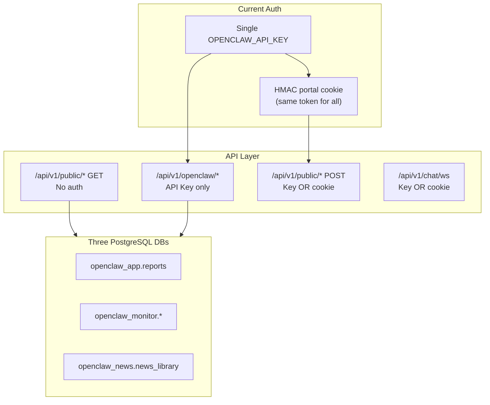
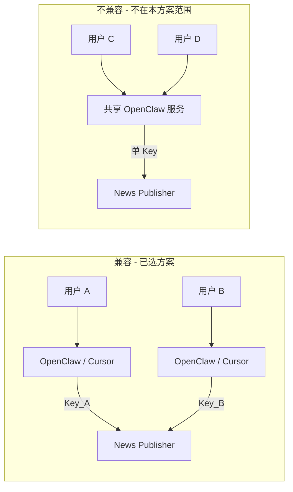
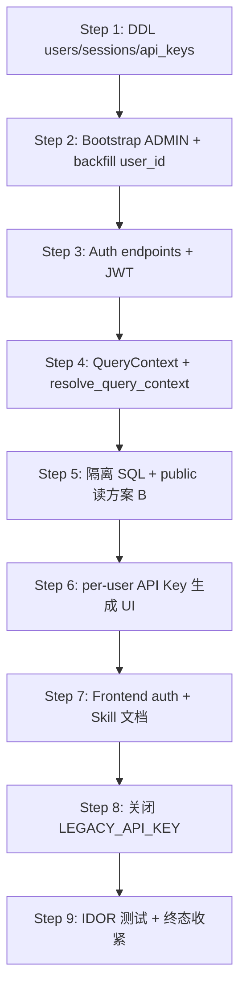

# 多用户 SaaS 迁移方案

> **归档（已实施 2026-06-05）** — 勿作待办清单。活跃鉴权约定见 `skills/_shared/multi-user-auth.md`；测试见 [multi-user-test-plan.md](../../human/testing/multi-user-test-plan.md)。

**项目**：OpenClaw News Publisher  
**文档版本**：1.1  
**生成日期**：2026-06-05  
**状态**：已实施（Step 1–9 完成，2026-06-05）

**实施摘要**：

| Step | 内容 | 状态 |
|------|------|------|
| S1–S6 | DDL、Auth、QueryContext、方案 B、API Key UI | ✅ |
| S7 | 前端 Login/Register/Account；5 个 Skill + `_shared/multi-user-auth.md`；对话式 Skill | ✅ |
| S8 | `OPENCLAW_LEGACY_API_KEY_ENABLED` 默认 **false**；移除 SPA Key 注入 | ✅ |
| S9 | PostgreSQL 集成测试（85 pytest）；`tests/api/conftest.py` fixture | ✅ |
| 待定 | public 读收紧为方案 A；前端 E2E 手动清单 | 可选 |

**已确认决策：**

- OpenClaw Agent：**每用户独立 API Key**，服务端按 Key 解析 `user_id`
- 历史数据：**全部归属首个 ADMIN 用户**
- Public 读接口：**过渡期采用方案 B**（见 §OpenClaw 兼容性与 Public 读接口过渡策略）

**关联文档：**

- [multi-user-test-plan.md](../../human/testing/multi-user-test-plan.md)
- [hardening-plan-2026-06-05.md](../../reports/security/hardening-plan-2026-06-05.md)
- [openclaw-intake.md](../../human/api/openclaw-intake.md)

---

## 目录

1. [当前架构](#1-当前架构)
2. [OpenClaw 兼容性与 Public 读接口过渡策略](#2-openclaw-兼容性与-public-读接口过渡策略)
3. [Phase 1 — Architecture Analysis](#phase-1--architecture-analysis)
4. [Phase 2 — User Model Design](#phase-2--user-model-design)
5. [Phase 3 — Authentication Design](#phase-3--authentication-design)
6. [Phase 4 — Database Isolation Design](#phase-4--database-isolation-design)
7. [Phase 5 — Authorization Design](#phase-5--authorization-design)
8. [Phase 6–10 — Implementation Outline](#phase-610--implementation-outline)
9. [迁移步骤](#9-迁移步骤)
10. [配置项](#10-配置项新增)
11. [边界与不做的事](#11-边界与不做的事)

---

## 1. 当前架构

### 1.1 系统概览



### 1.2 数据库（三库、7 表、无 user_id）

| 环境变量 | 数据库 | 核心表 |
|----------|--------|--------|
| `OPENCLAW_DATABASE_URL` | openclaw_app | `reports` |
| `OPENCLAW_MONITORING_DATABASE_URL` | openclaw_monitor | `price_monitors`, `price_monitor_urls`, `price_observations`, `external_scheduler_runs`, `external_scheduler_configs` |
| `OPENCLAW_NEWS_DATABASE_URL` | openclaw_news | `news_library` |

- 无 SQLAlchemy / Alembic；schema 由 `CREATE TABLE IF NOT EXISTS` + Docker init 维护
- 无 `users` 表、无 `user_id` 列、无 RBAC

### 1.3 API 鉴权现状（多用户实施后）

| 前缀 | 鉴权 | 用途 |
|------|------|------|
| `/api/v1/openclaw/*` | per-user `X-Api-Key` | Agent 入站、监测写入、新闻入库 |
| `/api/v1/public/*` GET | JWT / per-user Key（方案 B） | SPA 与 OpenClaw Skill 读库（按 `user_id` 过滤） |
| `/api/v1/public/*` POST 写操作 | JWT 或 per-user Key | 批量删除、工作流、诊断 |
| `/api/v1/public/auth/*` | 注册/登录/Refresh/API Key 管理 | 门户账户 |
| `/api/v1/chat/ws` | Refresh Cookie / Bearer / per-user Key | 聊天代理 |

Legacy 全局 Key：`OPENCLAW_LEGACY_API_KEY_ENABLED=false`（默认关闭）。过渡期可设为 `true` 映射 ADMIN。

关键文件：[`app/core/security.py`](../../app/core/security.py)、[`app/core/auth_service.py`](../../app/core/auth_service.py)、[`app/api/v1/auth.py`](../../app/api/v1/auth.py)

### 1.4 前端现状（多用户实施后）

- 登录 `/login`、注册 `/register`、账户 `/account`（API Key 管理）
- `AuthProvider` + `ProtectedRoute`；读/写 API 带 JWT 或 Cookie
- 门户聊天 `/` 经 WebSocket 连 OpenClaw Gateway；发送前有基础违规词过滤（`promptSafety`）
- **不再**向 SPA 注入 `VITE_OPENCLAW_API_KEY`

关键文件：[`frontend/src/lib/AuthContext.tsx`](../../frontend/src/lib/AuthContext.tsx)、[`frontend/src/pages/LoginPage.tsx`](../../frontend/src/pages/LoginPage.tsx)

---

## 2. OpenClaw 兼容性与 Public 读接口过渡策略

### 2.1 OpenClaw 在本项目中的含义

| 组件 | 路径/配置 | 角色 |
|------|-----------|------|
| **OpenClaw Skills** | `skills/openclaw-*` | Cursor / Gateway Agent 通过 HTTP 调用 News Publisher |
| **OpenClaw Gateway** | `OPENCLAW_OPENCLAW_WS_URL` | 门户聊天 WebSocket 代理（`sessionKey` 仅做对话连续性，非用户身份） |

OpenClaw **不是** News Publisher 内置的用户系统；它是 **HTTP/WS 客户端**，按 Skill 文档发送 `X-Api-Key` 等请求头。

### 2.2 兼容性结论

| 层面 | 是否支持多用户 | 说明 |
|------|----------------|------|
| **HTTP 协议层** | ✅ 支持 | 入站已是 `X-Api-Key`；服务端改为 per-user Key 解析 `user_id` 即可，请求体 schema 不变 |
| **Skill 产品层** | ❌ 无原生多用户 | 4 个 Skill 均假设单一 `OPENCLAW_OPENCLAW_API_KEY` + 无鉴权 public 读 |
| **推荐部署模式** | ✅ 兼容 | **每用户独立 Agent/Cursor 会话 + 独立 API Key**（已确认决策） |
| **共享 Agent 服务多租户** | ❌ 不兼容 | Skill 不会按用户切换 Key；需另行设计（全局 Key + `X-User-Id` 等） |

### 2.3 OpenClaw Skill 对 public 读接口的依赖

以下调用在 Skill 工作流中**不带** `X-Api-Key`，多用户后若直接改为 JWT-only 将导致 Skill 401：

| Skill | 无鉴权读接口 |
|-------|-------------|
| `openclaw-price-ingest-external` | `GET /public/monitoring/{id}/observations`, `timeseries` |
| `openclaw-price-analysis-reporting` | `GET /public/monitoring/*`, `/public/news/library`, `/public/reports` |
| `openclaw-news-publisher-enhanced` | 同上 + `external-jobs` |
| `openclaw-public-news-library` | `GET /public/news/library` |

写入路径（`POST /openclaw/*`）已带 Key，与 per-user Key 方案天然兼容。

### 2.4 部署模式



### 2.5 Public 读接口过渡策略

#### 方案 A（严格，终态目标）

- 所有 `GET /public/*` 必须 JWT（SPA）或 per-user API Key
- Skill 必须全面改造为带 Key 或 Bearer

#### 方案 B（过渡，**本方案采用**）

**规则：** `GET /public/*` 接受三种凭证之一，解析为 `QueryContext` 后按 `user_id` 过滤：

1. **JWT Access Token** — `Authorization: Bearer` 或短期 Cookie（SPA 门户）
2. **Per-user API Key** — `X-Api-Key`（OpenClaw Skill / cron，**改动最小**）
3. **Legacy 全局 Key** — 映射 bootstrap ADMIN（`OPENCLAW_LEGACY_API_KEY_ENABLED=true`，过渡期）

**实现要点：**

```python
# 新依赖：resolve_query_context
# 优先级：Bearer JWT > X-Api-Key (user key) > legacy global key (ADMIN)
async def resolve_query_context(request: Request) -> QueryContext: ...
```

| 凭证 | USER 行为 | ADMIN 行为 |
|------|-----------|------------|
| JWT（用户 A） | 仅返回 A 的数据 | — |
| API Key（用户 A） | 仅返回 A 的数据 | — |
| Legacy 全局 Key | — | 返回全量（与历史行为一致） |

**终态演进（Step 8 之后）：**

- 关闭 `OPENCLAW_LEGACY_API_KEY_ENABLED`
- Skill 文档全面改为 per-user Key + 带 Key 的 public 读
- 可选：将 Skill 读路径迁移到 `/openclaw/*` 对称接口

#### 方案对比

| | 方案 A | 方案 B（采用） |
|--|--------|----------------|
| Skill 改动量 | 大 | 小（读接口加 `X-Api-Key` 头即可） |
| 安全收紧速度 | 快 | 渐进 |
| SPA 体验 | 需全面 JWT | JWT + 读接口同样过滤 |
| 历史 cron/Agent | 立即中断 | Legacy Key 过渡期可用 |

### 2.6 OpenClaw 侧必须配合的变更（文档与配置，非 Agent 重写）

| 变更项 | 现状 | 多用户后 |
|--------|------|----------|
| Key 来源 | `OPENCLAW_OPENCLAW_API_KEY` | 门户「生成 API Key」→ 用户本地 env |
| 读监测/报告/新闻 | `GET /public/...` 无 Key | 带 `X-Api-Key: ${USER_API_KEY}`（方案 B） |
| `monitor_id` 持久化 | cron/Skill 本地保存 | 必须与同一用户 Key 配对 |
| 定时任务 | 全局 Key | 每用户 cron 用各自 Key |
| Gateway WS | 全局 Key / 静态 Cookie | JWT Refresh Cookie 或 Access Token |
| Skill 安全说明 | 单 Key 脱敏 | Key 等同账号凭证，不可共享 |

**需同步更新的文档（Phase 9 后）：** ✅ 已更新（2026-06-05）

- `skills/openclaw-news-publisher-enhanced/SKILL.md`
- `skills/openclaw-price-ingest-external/SKILL.md`
- `skills/openclaw-price-analysis-reporting/SKILL.md`
- `skills/openclaw-public-news-library/SKILL.md`
- `skills/openclaw-conversational-assistant/SKILL.md`
- `skills/_shared/multi-user-auth.md`
- `docs/api/openclaw-intake.md`

### 2.7 Findings / Proposed Changes / Risks / Migration Impact / Next Step

#### Findings

- OpenClaw 协议层与 per-user API Key **兼容**；Skill 层**无多用户概念**。
- Skill 强依赖无鉴权 public 读，是多用户迁移的**主要 breaking 风险点**。
- Legacy 全局 Key 在过渡期内可映射 ADMIN，保证现有 cron/Agent 不断服。

#### Proposed Changes

- 新增 `resolve_query_context` 统一解析 JWT / user Key / legacy Key。
- public 读接口采用方案 B；写接口与 openclaw 入站统一 user scope。
- Step 7 更新 4 个 Skill + intake 文档。

#### Risks

- 用户误用他人 `monitor_id` + 自己的 Key → 404（预期行为，需在 Skill 文档说明）。
- Legacy Key 关闭后，未迁移的 cron 将 401。

#### Migration Impact

- Skill 用户需在门户生成 Key 并更新本地/cron 配置。
- 服务端 public 读逻辑从「无过滤」变为「按 ctx 过滤」。

#### Next Step

- Phase 4 实现 `QueryContext` + `resolve_query_context`
- Phase 9 切换 public 读依赖并验证 Skill curl 示例

---

## Phase 1 — Architecture Analysis

### Findings

- 系统已是**三库分离 + 原始 SQL**，业务逻辑集中在 Service/Query 层，适合增量加列而非重写。
- 认证层仅有 `verify_api_key` 与 `verify_portal_write_auth`；**读接口零鉴权**，是当前最大 IDOR 风险面。
- Portal Cookie 是固定 HMAC 值（非 per-user session），无法直接复用为多用户会话。
- 报告除 DB 外还有文件系统副本（`content/reports/raw|rendered/{ingest_id}.json`），隔离需 DB + 文件访问双重校验。
- 安全加固已完成 Cookie/RateLimit/SSRF；RBAC（L-06）与本迁移目标对齐。
- OpenClaw Skill 依赖 public 无鉴权读（见 §2），需在 Phase 4/9 采用方案 B 过渡。

### Proposed Changes

需修改模块清单（按优先级）：

| 层级 | 模块 | 变更类型 |
|------|------|----------|
| DB | `openclaw_app`: 新增 `users`, `user_sessions`, `user_api_keys`；`reports.user_id` | 加表/加列 |
| DB | `openclaw_monitor`: 4 表加 `user_id` | 加列 + 索引 |
| DB | `openclaw_news`: `news_library.user_id` | 加列 + 索引 |
| Auth | `app/core/security.py` | 新增 `get_current_user`, `require_role`, `verify_user_api_key`, `resolve_query_context` |
| Auth | 新 `app/core/auth_service.py` | 注册/登录/Token/Key 管理 |
| DB | 新 `app/db/user_queries.py` | User CRUD |
| DB | 新 `app/db/query_context.py` | 统一 user_id 过滤 |
| API | `app/api/v1/public.py` | 读/写加 ctx；新增 `/auth/register|login|refresh|logout|me|api-keys` |
| API | `app/api/v1/openclaw.py` | `verify_user_api_key` |
| API | `app/api/v1/chat.py` | WS 改为用户 JWT/Cookie |
| Query | `app/db/public_queries.py` | 所有 SQL 加 `user_id` 条件 |
| Query | `app/db/repositories.py` | ingest 写入带 `user_id` |
| Service | `monitoring_service.py`, `intake_service.py`, `job_runner.py` | 传递 owner |
| Frontend | `auth.ts`, Login/Register, `AppShell`, `api.ts` | 用户认证 UI |
| Ops | `scripts/migrations/001_multi_user.sql` | DDL + backfill |
| Docs | 4 个 Skill + `openclaw-intake.md` | per-user Key + 带 Key 读 public |
| Tests | `tests/api/test_multi_user_*.py` | 隔离/权限/IDOR/OpenClaw Key |

### Risks

- 三库 `user_id` 无跨库 FK，需应用层保证一致。
- public 读从全局可见变为 scoped — Skill/cron 需配 Key。
- 无 Alembic — 需版本化 SQL 脚本。
- Legacy Key 退役窗口需与运维对齐。

### Migration Impact

- API 消费者（SPA、OpenClaw、cron）需更新凭证。
- Docker init、CI tests、`.env.example` 需扩展。
- `VITE_OPENCLAW_API_KEY` 生产路径移除。

### Next Step

确认本方案 → 实施 Phase 2–5 基础设施。

---

## Phase 2 — User Model Design

### Findings

- 无 User 实体；`IngestRecord` 是唯一 dataclass。
- `pyproject.toml` 无 bcrypt/argon2。

### Proposed Changes

**表 `users`（openclaw_app）**

```sql
CREATE TABLE users (
  id              UUID PRIMARY KEY DEFAULT gen_random_uuid(),
  email           TEXT NOT NULL UNIQUE,
  username        TEXT NOT NULL UNIQUE,
  password_hash   TEXT NOT NULL,
  role            TEXT NOT NULL DEFAULT 'USER'
                  CHECK (role IN ('USER', 'ADMIN')),
  status          TEXT NOT NULL DEFAULT 'active'
                  CHECK (status IN ('active', 'suspended', 'pending')),
  created_at      TIMESTAMPTZ NOT NULL DEFAULT NOW(),
  updated_at      TIMESTAMPTZ NOT NULL DEFAULT NOW(),
  last_login_at   TIMESTAMPTZ
);
```

**表 `user_api_keys`**

```sql
CREATE TABLE user_api_keys (
  id              UUID PRIMARY KEY DEFAULT gen_random_uuid(),
  user_id         UUID NOT NULL REFERENCES users(id) ON DELETE CASCADE,
  key_prefix      TEXT NOT NULL,
  key_hash        TEXT NOT NULL,
  label           TEXT DEFAULT 'default',
  created_at      TIMESTAMPTZ NOT NULL DEFAULT NOW(),
  last_used_at    TIMESTAMPTZ,
  revoked_at      TIMESTAMPTZ
);
CREATE UNIQUE INDEX idx_user_api_keys_hash ON user_api_keys (key_hash) WHERE revoked_at IS NULL;
```

**表 `user_sessions`**

```sql
CREATE TABLE user_sessions (
  id              UUID PRIMARY KEY DEFAULT gen_random_uuid(),
  user_id         UUID NOT NULL REFERENCES users(id) ON DELETE CASCADE,
  refresh_hash    TEXT NOT NULL UNIQUE,
  expires_at      TIMESTAMPTZ NOT NULL,
  created_at      TIMESTAMPTZ NOT NULL DEFAULT NOW(),
  revoked_at      TIMESTAMPTZ,
  ip_address      INET,
  user_agent      TEXT
);
```

**密码**：`argon2-cffi`（首选）；禁止明文存储。

### Risks

- email 需小写归一化；API Key 仅展示一次。

### Migration Impact

- 新增 3 表；依赖 `argon2-cffi`、`PyJWT`。

### Next Step

`001_multi_user.sql` users 部分 + bootstrap ADMIN CLI。

---

## Phase 3 — Authentication Design

### Findings

- Portal Cookie 为静态 HMAC，不可扩展为 per-user。
- SPA 已用 `credentials: 'include'`；CORS 已开 credentials。

### Proposed Changes

**JWT Access Token + HttpOnly Refresh Cookie + Per-user API Key**

| 凭证 | 存储 | TTL | 用途 |
|------|------|-----|------|
| Access JWT | 前端内存 | 15 min | SPA `Authorization: Bearer` |
| Refresh Token | Cookie `openclaw_refresh` | 7 days | silent refresh |
| User API Key | Agent env | 长期 | `/openclaw/*` + 方案 B public 读 |

**新端点** `/api/v1/public/auth/*`：`register`, `login`, `refresh`, `logout`, `me`, `api-keys`

**Dependencies**：`get_current_user`, `verify_user_api_key`, `resolve_query_context`, `require_role`

**登录限速**：5 次/15min per email；统一错误文案。

**Legacy**：`OPENCLAW_LEGACY_API_KEY_ENABLED` 映射 ADMIN；废弃静态 portal cookie。

### Risks

- 禁止 JWT 存 localStorage；页面刷新依赖 silent refresh。

### Migration Impact

- 重写 `frontend/src/lib/auth.ts`；更新 security tests。

### Next Step

实现 `auth_service.py` + JWT 配置项。

---

## Phase 4 — Database Isolation Design

### Findings

- 7 张业务表无 owner；`list_reports_from_db()` 等无 WHERE 过滤。
- 文件路径不含 user 前缀。

### Proposed Changes

**各表加 `user_id UUID NOT NULL`**（backfill ADMIN 后 SET NOT NULL）

**QueryContext**（`app/db/query_context.py`）：

```python
@dataclass(frozen=True)
class QueryContext:
    user_id: str
    role: str

    def owner_clause(self, alias: str = "") -> tuple[str, tuple]:
        """ADMIN 返回 ('', ()); USER 返回 ('AND user_id = %s', (user_id,))"""
```

所有 query/repository/service 方法接受 `ctx: QueryContext`。

**文件访问**：读/删文件前 DB 校验 ingest 归属。

**Backfill**：历史数据 → bootstrap ADMIN `user_id`。

### Risks

- `external_scheduler_configs` PK 改为 `(user_id, job_name)`。
- 联合分析需 monitor/news 同 user。

### Migration Impact

- 15+ SQL 函数签名变更；ingest 链路 4 文件传递 user。

### Next Step

`001_multi_user.sql` 加列 + backfill。

---

## Phase 5 — Authorization Design

### Findings

- 无 RBAC；ADMIN = 持有全局 Key 者。

### Proposed Changes

| 能力 | USER | ADMIN |
|------|------|-------|
| 自己的 reports/news/monitors | RW | RW |
| 他人数据 | 否 | 是 |
| diagnostics / gateway | 仅自己的 | 全部 |
| 用户管理 | 否 | 是（未来） |

**IDOR 规则**：detail/mutate 带 `user_id`；跨 user 返回 **404**（非 403）。

**OpenClaw Key**：自动 scope 到 Key 所属 user；不得访问他人 `monitor_id`。

### Risks

- ADMIN 全量访问建议后续加 `audit_log`。

### Migration Impact

- 全部 read/write endpoints 加 dependency。

### Next Step

见 Test Plan 权限矩阵。

---

## Phase 6–10 — Implementation Outline

### Phase 6 — Registration

- email/username 唯一；password 强度校验；409 重复；可选首用户 ADMIN。

### Phase 7 — Login

- argon2 验证；`last_login_at`；限速；安全错误提示。

### Phase 8 — Frontend

- Login/Register 页；AuthProvider；ProtectedRoute；AppShell 用户菜单；保持现有设计系统。

### Phase 9 — API Protection

- 读：`resolve_query_context`（方案 B）
- 写：`get_current_user`
- OpenClaw：`verify_user_api_key`
- WS：用户 JWT/Cookie
- 更新 Skill 文档

### Phase 10 — IDOR Audit

- 全量 ~35 端点清单
- Key A 不能读/写 Key B 资源
- bulk-delete 跨 user 拒绝

---

## 9. 迁移步骤



1. `scripts/migrations/001_multi_user.sql`（启动时亦可通过 `ensure_user_tables()` 应用）
2. 部署 DDL；创建 ADMIN；backfill ✅
3. Auth service + endpoints ✅
4. QueryContext + 逐模块 SQL 改造 ✅
5. API deps 切换；**public 读启用方案 B** ✅
6. 门户 API Key 管理（`/account`）✅
7. 前端 auth + **5 个 Skill** 文档更新（含 `openclaw-conversational-assistant`）✅
8. 关闭 legacy global key（默认 `false`）✅
9. 全量 pytest 集成测试（85 项）✅；可选 public 读收紧为方案 A

---

## 10. 配置项新增

```env
OPENCLAW_JWT_SECRET=              # prod >= 32 chars
OPENCLAW_JWT_ACCESS_TTL=900
OPENCLAW_JWT_REFRESH_TTL=604800
OPENCLAW_ALLOW_REGISTRATION=true
OPENCLAW_FIRST_USER_IS_ADMIN=true
OPENCLAW_LEGACY_API_KEY_ENABLED=false
OPENCLAW_LOGIN_MAX_ATTEMPTS=5
OPENCLAW_LOGIN_LOCKOUT_SECONDS=900
```

---

## 11. 边界与不做的事

- 不重写 IntakeService / JobRunner / ReportService 核心逻辑
- 不合并三库；不引入 SQLAlchemy ORM
- 不实现 MODERATOR / OAuth / subdomain 多租户
- 不支持「单共享 OpenClaw 服务代理多用户」（除非另开架构方案）
- Bootstrap ADMIN 默认邮箱 `admin@localhost`；初始密码须在部署后通过门户或运维脚本设置（非占位 hash 登录）
