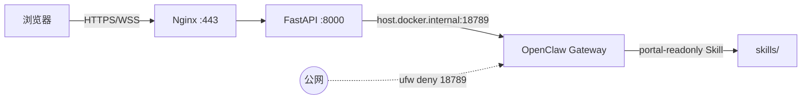

# Gateway 网络与权限隔离

**优先级**：P0 — 门户 USER 不得获得 Gateway 管理员能力  
**状态**：2026-06 已实施（后端代理 + 双 Agent + 双 device + 审计）  
**关联**：[openclaw-skills-gateway.md](../deployment/openclaw-skills-gateway.md)、[portal-chat.md](../features/portal-chat.md)

---

## 1. 威胁模型

门户聊天经 FastAPI WebSocket 代理（`/api/v1/chat/ws`）转发至 OpenClaw Gateway。若代理使用**单一 admin device** 连接 Gateway，则每个登录 USER 在 Gateway 侧等效为管理员，可读写宿主机文件、执行系统命令。

**修复原则**：

1. Gateway **不对公网开放**（防火墙 + 不映射 Docker 18789）
2. **两套 device 凭证**：portal（受限 scopes）与 admin（完整）
3. **两个 Agent**：`portal-readonly`（USER）与 `main`（ADMIN）
4. 后端 **GatewayPermissionChecker** + **gateway_audit_events** 审计

---

## 2. 网络拓扑



| 组件 | 绑定 / 访问 | 说明 |
|------|-------------|------|
| OpenClaw Gateway | 宿主机 `0.0.0.0:18789` 或 `lan` | Docker 容器经 `host.docker.internal` 访问；**须**配合防火墙 |
| FastAPI | `127.0.0.1:8000`（Docker 映射） | 唯一 Web 入口（前置 Nginx 反代） |
| Docker app 容器 | **不** publish 18789 | `OPENCLAW_OPENCLAW_WS_URL=ws://host.docker.internal:18789/ws` |

> **说明**：Gateway 若设为纯 `loopback`，Docker 容器无法经 bridge 访问。生产推荐 **Gateway `bind: lan` + `ufw deny 18789/tcp`**，或 app 使用 `network_mode: host`（需调整数据库 DSN）。

### 防火墙（生产必做）

```bash
sudo ufw deny 18789/tcp
sudo ufw allow 443/tcp
sudo ufw allow 22/tcp
sudo ufw enable
sudo ufw status
```

验证：外网扫描 18789 应 filtered/refused；容器内 `probe_openclaw_gateway` 应 `ok: true`。

---

## 3. 双 Agent 配置（OpenClaw CLI）

在 Gateway 宿主机执行：

```bash
# 1. 添加 portal 只读 Agent
mkdir -p ~/.openclaw/workspace-portal
openclaw agents add portal-readonly \
  --non-interactive \
  --workspace ~/.openclaw/workspace-portal

# 2. 仅挂载对话入口 Skill
openclaw config set 'agents.list[1].skills' \
  '["openclaw-conversational-assistant"]' --strict-json

# 3. 重启 Gateway
openclaw gateway restart
```

确认：

```bash
openclaw agents list
# 应看到 main（默认）与 portal-readonly
```

`main` Agent 保留现有全技能；门户 **USER** 对话由后端路由至 `portal-readonly`，**ADMIN** 路由至 `main`。

---

## 4. 双 device 凭证

News Publisher 按门户角色选择 Gateway state 目录：

| 门户角色 | 容器路径 / 环境变量 | 用途 |
|----------|---------------------|------|
| USER | `OPENCLAW_GATEWAY_PORTAL_STATE_DIR` → `/openclaw-portal-state` | scopes：`operator.read` + `operator.write`（**不含** admin/pairing） |
| ADMIN | `OPENCLAW_GATEWAY_STATE_DIR` → `/openclaw-state` | 完整 operator scopes |

### 创建 portal state 目录（宿主机）

```bash
cd /opt/openclaw_news_publisher

# 从 admin state 复制结构（勿提交 Git，含 device 私钥）
cp -a openclaw-state openclaw-portal-state

# 将 paired.json 中 scopes 降为只读（示例）
python3 << 'PY'
import json
from pathlib import Path
p = Path("openclaw-portal-state/devices/paired.json")
data = json.loads(p.read_text())
for entry in data.values():
        entry["scopes"] = ["operator.read", "operator.write"]
        entry["approvedScopes"] = ["operator.read", "operator.write"]
    if "tokens" in entry and "operator" in entry["tokens"]:
        entry["tokens"]["operator"]["scopes"] = ["operator.read"]
    entry["displayName"] = "openclaw-news-publisher-portal"
p.write_text(json.dumps(data, indent=2) + "\n")
PY
```

`docker-compose.yml` 挂载：

```yaml
volumes:
  - ./openclaw-state:/openclaw-state:ro
  - ./openclaw-portal-state:/openclaw-portal-state:ro
```

`.env` 示例：

```env
OPENCLAW_GATEWAY_STATE_DIR=/openclaw-state
OPENCLAW_GATEWAY_PORTAL_STATE_DIR=/openclaw-portal-state
OPENCLAW_GATEWAY_PORTAL_AGENT_ID=portal-readonly
OPENCLAW_GATEWAY_ADMIN_AGENT_ID=main
OPENCLAW_CHAT_ENABLED_FOR_USER=true
OPENCLAW_CHAT_USER_MESSAGES_PER_MINUTE=30
```

**生产 fail-fast**：`OPENCLAW_PRODUCTION=true` 且 `OPENCLAW_CHAT_ENABLED_FOR_USER=true` 时，未配置 `OPENCLAW_GATEWAY_PORTAL_STATE_DIR` 将拒绝启动。

---

## 5. 后端代理行为

| 检查点 | 实现 |
|--------|------|
| 鉴权 | WS 握手 JWT / Cookie / API Key；匿名拒绝 |
| 角色 | USER → portal agent + portal state；ADMIN → admin agent |
| sessionKey | 客户端 UUID；Gateway 侧 `{agent_id}:{user_id}:{uuid}` |
| 消息过滤 | `GatewayPermissionChecker` + `prompt_safety` |
| 上下文注入 | `[PORTAL_CONTEXT role=USER ...]` 系统前缀 |
| 审计 | `gateway_audit_events` 表；ADMIN `GET /api/v1/public/audit/gateway-events` |
| 紧急开关 | `OPENCLAW_CHAT_ENABLED_FOR_USER=false` 仅 ADMIN 可聊天 |

关键代码：

- `app/services/gateway_permission_checker.py`
- `app/services/openclaw_chat_bridge.py`
- `app/api/v1/chat.py`
- `app/db/audit_queries.py`

---

## 6. 部署与更新

```bash
# 更新代码后（生产推荐 rebuild；热修复可挂载 ./app）
docker compose --profile full up -d app --force-recreate

# 验证
curl -s http://127.0.0.1:8000/healthz
docker exec openclaw_news_publisher-app-1 \
  test -f /app/app/services/gateway_permission_checker.py && echo OK
```

---

## 7. 验收清单

- [ ] USER 问「我是否是管理员」→ 回答门户 USER，**非** Gateway admin
- [ ] USER 发送 `cat /etc/passwd` → 后端拦截，audit `decision=blocked`
- [ ] `ufw status` 含 `18789/tcp DENY`
- [ ] 容器内 Gateway probe `ok: true`
- [ ] 生产 `.env` 已配置 `OPENCLAW_GATEWAY_PORTAL_STATE_DIR`
- [ ] `pytest tests/api/test_gateway_security.py` 通过

---

## 8. 剩余风险

| 风险 | 缓解 |
|------|------|
| Gateway Agent prompt injection | sandbox + 最小 Skill + 审计 |
| portal device 误配 admin scopes | 部署 checklist + paired.json 审查 |
| ADMIN 路径仍具完整 Gateway 能力 | 审计日志；后续 step-up 确认 |
