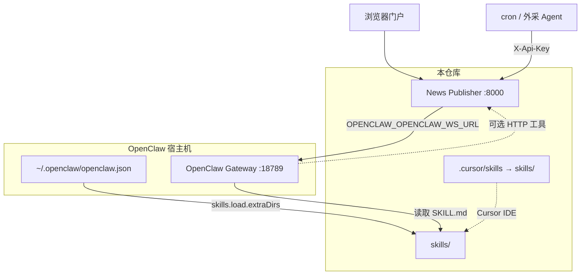

# OpenClaw Skills 部署指南

**适用版本**：Skill 包 **2.0.1**（见 [`skills/VERSIONS.md`](../skills/VERSIONS.md)）  
**受众**：运维、部署 News Publisher + OpenClaw Gateway 的工程师

本文说明如何将仓库根目录 [`skills/`](../skills/) 挂载到 **OpenClaw Gateway**，并与本项目的 **News Publisher API**、**多用户 API Key** 对齐。

---

## 0. 路径约定

| 路径 | 说明 |
|------|------|
| **`skills/`**（仓库根） | **权威路径**；Git 跟踪、Gateway `extraDirs`、运维脚本均使用此目录 |
| **`.cursor/skills`** | 指向 `skills/` 的 **符号链接**，供 Cursor IDE 自动发现 Skill |

克隆仓库后应存在：

```bash
ls -la .cursor/skills
# .cursor/skills -> ../skills
```

若符号链接缺失，可手动创建：

```bash
ln -sfn ../skills .cursor/skills
```

---

## 1. 架构关系



| 组件 | 是否在本仓库 | 说明 |
|------|----------------|------|
| **News Publisher** | ✅ | FastAPI + SPA；提供 `/api/v1/openclaw/*` 入站与门户 |
| **`skills/`** | ✅ | Agent 指令、`_shared` 策略、爬虫脚本（增强包） |
| **OpenClaw Gateway** | ❌ | 独立安装；门户 `/` 对话经 WS 连 Gateway |

部署 News Publisher **不会**自动把 Skill 装入 Gateway，须按本文 **第 3 节** 配置。

---

## 2. Skill 包结构（部署时必须整包）

```
skills/
├── CHANGELOG.md
├── VERSIONS.md
├── _shared/                    # 鉴权、schema、安全策略（非独立 Skill）
│   ├── multi-user-auth.md
│   ├── agent-safety-baseline.md
│   ├── portal-chat-routing.md
│   ├── public-deploy-security.md
│   ├── quota-policy.md
│   └── ...
├── openclaw-conversational-assistant/   # 对话默认入口
├── openclaw-user-workspace/
├── openclaw-report-security/
├── openclaw-audit-events/
├── openclaw-news-publisher-enhanced/    # 含 scripts/ tools/ config/
├── openclaw-price-ingest-external/
├── openclaw-price-analysis-reporting/
└── openclaw-public-news-library/
```

**重要**：

- 各 Skill 通过 `../_shared/*.md` **相对路径**引用共享文档；**不要**只拷贝单个 `SKILL.md`。
- `openclaw-news-publisher-enhanced` 依赖同目录下 `scripts/`、`tools/`、`config/`，须保留完整目录。

---

## 3. 挂载到 OpenClaw Gateway（推荐）

OpenClaw 从工作区 `skills/`、`~/.openclaw/skills`、`skills.load.extraDirs` 等加载 Skill。  
本仓库根目录 **`skills/`** 与 OpenClaw 工作区命名一致，可直接作 `extraDirs`。  
官方说明：[OpenClaw Skills](https://docs.openclaw.ai/tools/skills)、[Skills config](https://docs.openclaw.ai/tools/skills-config)。

### 3.1 方式 A：`extraDirs`（推荐）

在 **运行 Gateway 的机器**上，假设本仓库位于 `/opt/openclaw_news_publisher`：

编辑 `~/.openclaw/openclaw.json`（路径以实际安装为准）：

```json5
{
  skills: {
    load: {
      extraDirs: ["/opt/openclaw_news_publisher/skills"],
      watch: true,
      watchDebounceMs: 250
    },
    entries: {
      "openclaw-conversational-assistant": {
        enabled: true,
        env: {
          BASE_URL: "https://portal.example.com"
        }
      },
      "openclaw-user-workspace": { enabled: true },
      "openclaw-report-security": { enabled: true },
      "openclaw-news-publisher-enhanced": { enabled: true },
      "openclaw-price-ingest-external": { enabled: true },
      "openclaw-price-analysis-reporting": { enabled: true },
      "openclaw-public-news-library": { enabled: true },
      "openclaw-audit-events": { enabled: true }
    }
  },
  agents: {
    defaults: {
      skills: [
        "openclaw-conversational-assistant",
        "openclaw-user-workspace",
        "openclaw-report-security",
        "openclaw-news-publisher-enhanced",
        "openclaw-price-ingest-external",
        "openclaw-price-analysis-reporting",
        "openclaw-public-news-library",
        "openclaw-audit-events"
      ]
    }
  }
}
```

重启 Gateway 后，**新开对话会话** 加载 Skill 快照（已开启 `watch` 时，改 `SKILL.md` 后下一轮对话可刷新）。

### 3.2 方式 B：符号链接到 `~/.openclaw/skills`

```bash
SKILLS_SRC="/opt/openclaw_news_publisher/skills"
mkdir -p ~/.openclaw/skills

for d in "$SKILLS_SRC"/openclaw-*; do
  ln -sfn "$d" ~/.openclaw/skills/$(basename "$d")
done
# 保留 _shared 在 SKILLS_SRC/_shared，各 Skill 的 ../_shared 链接仍有效
```

### 3.3 方式 C：`openclaw skills install`

```bash
openclaw skills install /opt/openclaw_news_publisher/skills/openclaw-conversational-assistant --global
# 对其余 openclaw-* 目录重复；news-publisher-enhanced 必须装整个目录
```

单独 install 时若未保留 `_shared` 父目录，相对链接会断裂；**生产环境优先方式 A**。

### 3.4 Docker 中的 Gateway

若 Gateway 跑在容器内，须将宿主机 `skills/` **卷挂载**到容器内，且 `extraDirs` 写容器内路径，例如：

```yaml
volumes:
  - /opt/openclaw_news_publisher/skills:/skills/openclaw-news-publisher:ro
```

```json5
skills: { load: { extraDirs: ["/skills/openclaw-news-publisher"] } }
```

---

## 4. News Publisher 侧配置

部署应用后（见 [server-deployment.md](server-deployment.md)），在 `.env` 中配置 Gateway 地址：

```env
OPENCLAW_OPENCLAW_WS_URL=ws://127.0.0.1:18789/ws
```

| 变量 | 说明 |
|------|------|
| `OPENCLAW_OPENCLAW_WS_URL` | 门户聊天 WebSocket 代理目标 |
| `OPENCLAW_LEGACY_API_KEY_ENABLED` | 生产保持 `false` |
| `OPENCLAW_PRODUCTION` | 生产 `true` |

Gateway 与 News Publisher 网络须互通（同机 `127.0.0.1` 或内网 IP）。

### 4.1 Gateway 权限隔离（P0，生产必做）

门户 USER 不得共用 admin Gateway device。详见 **[security/GATEWAY_ISOLATION.md](security/GATEWAY_ISOLATION.md)**。

| 变量 | 说明 |
|------|------|
| `OPENCLAW_GATEWAY_STATE_DIR` | ADMIN 门户聊天使用的 Gateway device 目录 |
| `OPENCLAW_GATEWAY_PORTAL_STATE_DIR` | USER 门户聊天使用的**受限** device 目录（生产必填） |
| `OPENCLAW_GATEWAY_PORTAL_AGENT_ID` | USER 路由到的 Agent（默认 `portal-readonly`） |
| `OPENCLAW_GATEWAY_ADMIN_AGENT_ID` | ADMIN Agent（默认 `main`） |
| `OPENCLAW_CHAT_ENABLED_FOR_USER` | `false` 时仅 ADMIN 可门户聊天 |

Gateway `openclaw.json` 须配置双 Agent：`portal-readonly`（仅 `openclaw-conversational-assistant`）与 `main`（全 Skill）。Gateway **bind 127.0.0.1**，防火墙拒绝公网 18789。

---

## 5. API Key 与 Agent 环境

### 5.1 凭证模型

| 场景 | 凭证 | 说明 |
|------|------|------|
| 门户用户浏览器 | JWT + HttpOnly Cookie | 登录后操作门户页面 |
| OpenClaw / cron Agent | per-user `X-Api-Key` | 门户 **账户 → API Key 管理** 生成 |
| Skill 环境变量 | `BASE_URL` + `API_KEY` | 注入 Gateway 配置或宿主机 env |

详见 [`skills/_shared/multi-user-auth.md`](../skills/_shared/multi-user-auth.md)。

### 5.2 注入 `BASE_URL` / `API_KEY`

**禁止**将真实 API Key 写入 Git 或 Skill 文档。

推荐：

1. **`skills.entries.<skill>.env`**（Gateway 主机 `openclaw.json`）  
2. 或 cron/systemd 的 `Environment=`  
3. 生产可使用 OpenClaw 的 `apiKey` / SecretRef（见官方 Skills config）

```json5
"openclaw-price-ingest-external": {
  enabled: true,
  env: {
    BASE_URL: "https://portal.example.com",
    API_KEY: "oc_live_..."   // 每用户/每 Agent 独立 Key
  }
}
```

**多用户 SaaS**：每个自动化任务使用 **自己的** per-user Key；`monitor_id` 须与创建该 monitor 时使用的 Key 一致。

### 5.3 增强包 Python 依赖

若 Gateway Agent 会执行 `openclaw-news-publisher-enhanced` 内爬虫/CLI：

```bash
cd /opt/openclaw_news_publisher/skills/openclaw-news-publisher-enhanced
python3 -m pip install -r requirements.txt
```

---

## 6. Cursor IDE（开发环境）

开发者 clone 本仓库后，Cursor 通过 **`.cursor/skills` → `skills/`** 符号链接自动加载 Skill。

```bash
export BASE_URL="http://127.0.0.1:8000"
export API_KEY="<门户账户页生成的 Key>"
```

本地双进程调试见 [developer-guide.md](developer-guide.md)。

---

## 7. 门户聊天 vs Cursor / cron

| 环境 | Skill 来源 | 能否直接调 News Publisher API |
|------|------------|-------------------------------|
| **Cursor**（打开本仓库） | `.cursor/skills` → `skills/` | ✅（配 `API_KEY`） |
| **门户 `/` 聊天** | Gateway 已加载 Skill | ⚠️ 仅当 Gateway 配置 HTTP 工具；默认 WS 不内置 API |
| **cron / 外采脚本** | Gateway 或独立 Agent | ✅ `curl` + `X-Api-Key` |

门户写操作（建监测、发报告）若聊天中未真正执行，见 [`skills/_shared/portal-chat-routing.md`](../skills/_shared/portal-chat-routing.md)。对话后台生成与轮询见 [portal-chat.md](../docs/portal-chat.md)。

---

## 8. 发布与更新流程

```bash
# 1. 更新代码
cd /opt/openclaw_news_publisher && git pull

# 2. 重启 News Publisher（按你的部署方式）
docker compose up -d app
# 或 systemctl restart openclaw-news-publisher

# 3. Skill 变更
#    - extraDirs + watch:true → 通常下一轮 Gateway 对话即生效
#    - 否则重启 Gateway

# 4. 验证
openclaw skills list    # Gateway 主机
curl -s https://portal.example.com/healthz

# 5. CI 门禁（在应用目录 venv 内）
pytest -q tests/api/test_multi_user_*.py tests/api/test_security_*.py
```

发布前检查清单：[`skills/_shared/ci-skill-regression.md`](../skills/_shared/ci-skill-regression.md)。

---

## 9. 验证清单

| # | 检查项 | 通过标准 |
|---|--------|----------|
| 1 | 仓库路径 | `skills/` 存在；`.cursor/skills` 指向 `../skills` |
| 2 | Gateway 加载 Skill | `openclaw skills list` 含 8 个 `openclaw-*` |
| 3 | `_shared` 可访问 | Agent 能按 Skill 内链接理解鉴权（无断链） |
| 4 | 门户 WS | 首页对话非长期「连接中」；`OPENCLAW_OPENCLAW_WS_URL` 正确 |
| 5 | per-user Key | `POST /openclaw/reports` 带用户 A Key → 仅 A 可见报告 |
| 6 | 跨用户隔离 | 用户 B Key 读 A 的 `ingest_id` → **404** |
| 7 | 报告安全门 | 发布路径经 `openclaw-report-security`（见 Skill §11） |
| 8 | Legacy Key | `OPENCLAW_LEGACY_API_KEY_ENABLED=false` |

---

## 10. 故障排查

| 现象 | 可能原因 | 处理 |
|------|----------|------|
| Cursor 无 Skill | `.cursor/skills` 链接断裂 | `ln -sfn ../skills .cursor/skills` |
| 对话无 Skill 行为 | Gateway 未配置 `extraDirs` | 按 §3.1 配置并新开会话 |
| `../_shared` 引用失效 | 只安装了单个 Skill 目录 | 改为整包 `extraDirs` 指向 `skills/` |
| 爬虫/CLI 报错 | 未装 `requirements.txt` | §5.3 |
| 401 / 403 | Key 无效或撤销 | 门户重新生成 Key |
| 404 monitor / report | Key 与 `monitor_id` 不配对 | `openclaw-user-workspace` 列本用户资源 |
| 门户聊天「已发布」但未入库 | WS 无 HTTP 工具 | 引导 Cursor 或门户页面；见 portal-chat-routing |
| Skill 更新不生效 | 旧会话快照 | 新开会话或重启 Gateway |

---

## 11. 相关文档

| 文档 | 内容 |
|------|------|
| [server-deployment.md](server-deployment.md) | News Publisher 生产部署 |
| [deployment.md](deployment.md) | 本地开发、Gateway 说明 |
| [api/openclaw-intake.md](api/openclaw-intake.md) | 入站 API 契约 |
| [`skills/SKILL_REFACTOR_PLAN.md`](../skills/SKILL_REFACTOR_PLAN.md) | Skill 架构总览 |
| [`skills/VERSIONS.md`](../skills/VERSIONS.md) | 版本表 |
| [OpenClaw Skills 官方文档](https://docs.openclaw.ai/tools/skills) | Gateway Skill 加载机制 |
