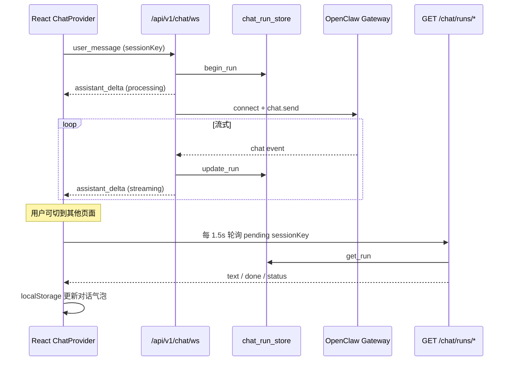

# 门户 OpenClaw 对话

门户首页（`/`）提供与 OpenClaw Gateway 的自然语言对话。消息经 FastAPI WebSocket 代理到 Gateway，回复流式回传；**切换 SPA 页面不会中断服务端生成**，客户端通过轮询恢复状态。

## 架构



| 组件 | 路径 | 职责 |
|------|------|------|
| WebSocket | `app/api/v1/chat.py` | 鉴权、限速、派发后台 `chat.send` |
| 运行态存储 | `app/services/chat_run_store.py` | 内存中保存每轮 `sessionKey` 的最新正文与状态 |
| Gateway 桥 | `app/services/openclaw_chat_bridge.py` | 设备签名、`stream_openclaw_reply`、空闲/总超时 |
| 前端 Provider | `frontend/src/features/chat/ChatProvider.tsx` | 全站常驻 WS、pending 轮询、发送/取消 |
| 对话 UI | `frontend/src/features/chat/ChatPage.tsx` | 首页布局与气泡 |
| 本地会话 | `frontend/src/features/chat/storage.ts` | `localStorage` 多会话历史 |
| 进行中标记 | `frontend/src/features/chat/pendingRuns.ts` | `localStorage` 未完成 `sessionKey` 列表 |

## 鉴权

| 通道 | 凭证 |
|------|------|
| `GET /api/v1/chat/ws` | HttpOnly Refresh Cookie / Bearer / `X-Api-Key`（**禁止** Query `?api_key=`） |
| `GET /api/v1/chat/runs/*` | 同上（`credentials: 'include'`） |

数据按登录用户隔离；`sessionKey` 仅用于对话连续性，归属由服务端 `user_id` 校验。

## HTTP / WebSocket API

### WebSocket `GET /api/v1/chat/ws`

**客户端 → 服务端**

| type | 字段 | 说明 |
|------|------|------|
| `user_message` | `sessionKey`, `text` | 发起一轮对话 |
| `cancel_message` | `sessionKey` | 请求停止当前轮（Gateway 侧取消） |

**服务端 → 客户端**

| type | 字段 | 说明 |
|------|------|------|
| `assistant_delta` | `sessionKey`, `text`, `done`, `status` | 流式正文；`status`: `processing` / `streaming` / `done` / `cancelled` / `timeout` |
| `assistant_error` | `sessionKey`, `error` | 失败（Gateway 不可用、校验失败等） |

### REST 轮询（后台恢复）

| 方法 | 路径 | 说明 |
|------|------|------|
| GET | `/api/v1/chat/runs/active` | 当前用户进行中的任务（至多 1 条） |
| GET | `/api/v1/chat/runs/{session_key}` | 指定会话最新状态；他人/不存在 → 404 |

响应示例：

```json
{
  "sessionKey": "uuid",
  "text": "助手回复正文…",
  "done": false,
  "status": "streaming",
  "error": null,
  "updatedAt": 1717654321.5
}
```

## 环境变量

| 变量 | 默认 | 说明 |
|------|------|------|
| `OPENCLAW_OPENCLAW_WS_URL` | `ws://localhost:18789/ws` | Gateway WebSocket 地址 |
| `OPENCLAW_CHAT_RECV_TIMEOUT_SECONDS` | `120` | 单轮等待下一条 Gateway 事件的最长空闲时间 |
| `OPENCLAW_CHAT_TOTAL_TIMEOUT_SECONDS` | `600` | 单轮总 wall-clock 上限 |
| `OPENCLAW_WS_MESSAGES_PER_MINUTE` | `12` | 每条 WS 连接 `user_message` 限速 |

Gateway 需单独启动；Docker 应用经 `host.docker.internal` 访问宿主机 Gateway，见 [deployment.md](deployment.md)、[openclaw-skills-deploy.md](openclaw-skills-deploy.md)。

## 前端行为

1. **`ChatProvider`** 包裹已登录路由（`App.tsx`），WebSocket **不随首页卸载而关闭**。
2. 发送消息后 `sessionKey` 写入 `pendingRuns` + `localStorage` 对话列表。
3. 进行中的任务每 **1.5s** 调用 `GET /chat/runs/{sessionKey}`，与 WS 推送互为补充。
4. 导航栏 **首页** 在存在 pending 任务时显示「生成中」角标。
5. 首页可点击 **停止生成**（`cancel_message`）；客户端另有 ~630s 兜底 watchdog。

对话历史仅存浏览器 `localStorage`（`oc_portal_chat_v1`），**清缓存会丢失**；服务端 `chat_run_store` 为内存态，**进程重启后进行中任务不可恢复**（已完成轮询到的正文仍在 localStorage）。

## 与 Skill 的边界

门户 WS **不内置** News Publisher HTTP 工具。写操作（建监测、发报告等）须 Cursor Skill + per-user API Key，或门户对应页面。见 [`skills/_shared/portal-chat-routing.md`](../skills/_shared/portal-chat-routing.md)。

## 故障排查

| 现象 | 排查 |
|------|------|
| 长期「连接中…」 | Gateway 未启动、`OPENCLAW_OPENCLAW_WS_URL` 错误、反代未升级 WS |
| 切页后无完整回复 | 确认已部署后台 run + 轮询；看 `GET /chat/runs/active` 是否 200 |
| 停止无效 | WS 是否仍连接；同一用户是否仅一条进行中任务 |
| 429 / busy | 上一条未完成；等待或停止后再发 |
| 重启 app 后轮询 404 | 内存 store 已清空；仅 localStorage 中已同步段落保留 |

## 演进

- [ ] PostgreSQL 持久化 `chat_runs` / 消息历史（替代内存 store + 纯 localStorage）
- [ ] 多 worker 下 run 状态外置（Redis/DB）
