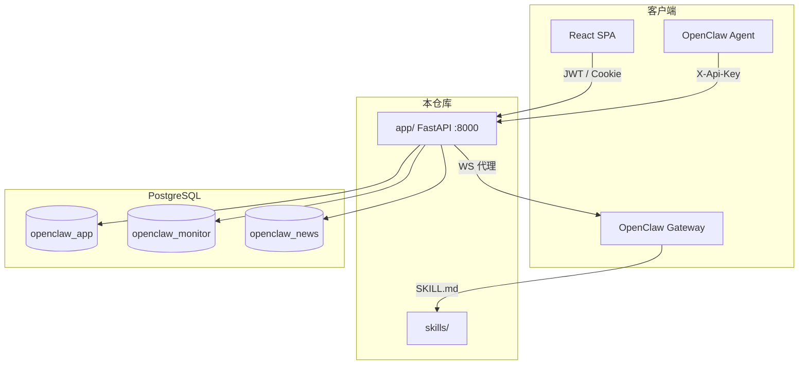

# 架构摘要

> 完整版：[human/architecture/overview.md](../human/architecture/overview.md)

## 系统概览



## 三库

| 环境变量 | 库 | 核心表 | 建表 |
|----------|-----|--------|------|
| `OPENCLAW_DATABASE_URL` | openclaw_app | `reports`, `users`, … | Docker init SQL 或 manual DDL |
| `OPENCLAW_MONITORING_DATABASE_URL` | openclaw_monitor | `price_monitors`, … | 首次 API 调用 |
| `OPENCLAW_NEWS_DATABASE_URL` | openclaw_news | `news_library` | 首次写入 |

## API 分层

| 前缀 | 鉴权 | 用途 |
|------|------|------|
| `/api/v1/openclaw/*` | per-user `X-Api-Key` | Agent 入站、监测、新闻库写入 |
| `/api/v1/public/*` | JWT / Key | SPA 读、工作流、账户 |
| `/api/v1/auth/*` | JWT / Cookie | 注册、登录、Refresh |
| `/api/v1/chat/*` | JWT / Cookie / Key | Gateway WebSocket + run 轮询 |

## 报告流水线

OpenClaw Skill → `POST /openclaw/reports` → `IntakeService`（幂等）→ `JobRunner`（渲染）→ PostgreSQL + 可选 Git publish。

## 多用户隔离

- `QueryContext`：`user_id` + `role`（USER / ADMIN）
- 鉴权优先级：Bearer JWT > per-user API Key > Legacy 全局 Key（默认关闭）
- Bootstrap ADMIN：`admin@localhost`（空库时自动创建）

## Gateway 隔离（生产 P0）

USER 与 ADMIN 使用不同 Gateway Agent（`portal-readonly` / `main`）与 device 目录。详见 [gateway-isolation.md](../human/security/gateway-isolation.md)。

## 代码分层约定

```
API (api/v1/) → Service (services/) → DB (db/)
```

**已知例外（技术债 KI-001）**：`news_analysis_service.py` 从 `api/v1/openclaw` 导入 `intake_service` 单例 — 应改为依赖注入，见 [KNOWN_ISSUES.md](KNOWN_ISSUES.md)。

## 模块入口

| 路径 | 职责 |
|------|------|
| `app/main.py` | App 工厂、中间件、SPA |
| `app/api/v1/openclaw.py` | Agent API |
| `app/api/v1/public.py` | 门户 REST |
| `app/api/v1/chat.py` | 对话 WS |
| `app/services/intake_service.py` | 入站幂等 |
| `app/workers/job_runner.py` | 后台渲染 |
| `frontend/src/` | React SPA |
