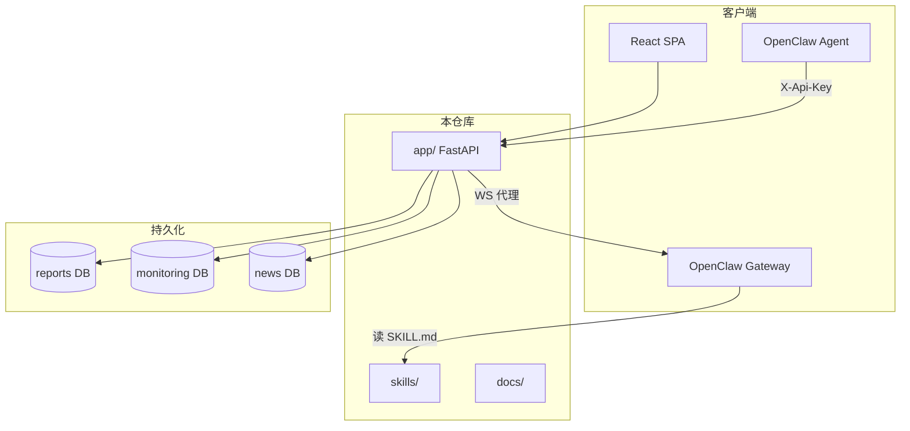

# OpenClaw News Publisher — 项目治理审查报告

**角色**：Project Governance Agent  
**审查日期**：2026-06-08  
**审查范围**：`docs/`、`skills/`、`scripts/`、`frontend/`、`app/`（后端）、部署相关根目录文件  
**约束**：只读审查；未修改代码、未移动/删除任何文件  

**成功标准对照**（目标状态）：

| 标准 | 当前评估 |
|------|----------|
| 新开发者 30 分钟理解项目 | ⚠️ 部分达成 — README + `PROJECT_DOCUMENT_INDEX` 质量高，但根目录散落 7+ 份 Agent 报告/plan 干扰导航 |
| 新开发者 1 小时完成部署 | ⚠️ Docker 路径接近；裸机路径需自备 PostgreSQL + 手动 DDL，通常 >1 小时 |
| Agent 文档与人类文档分离 | ✅ 基本达成 — `docs/human/` vs `docs/openclaw/` + `skills/`；根目录 Agent 产物未归档 |
| Skill 职责明确 | ✅ 8 个生产 Skill + `_shared` 分层清晰 |
| docs 目录结构清晰 | ✅ 2026-06-08 迁移后结构合理；仍有兼容 stub 与根目录重复 |
| 可维护性 | ⚠️ 架构分层有一处 API↔Service 逆依赖；技术债文档分散 |

---

## 扫描摘要（Phase 1）

| 目录 | 状态 | 说明 |
|------|------|------|
| `docs/` | ✅ 存在 | 32 个 `.md`；`human/`、`openclaw/`、`reports/`、`archive/` 分区明确 |
| `skills/` | ✅ 存在 | 35 文件；8 个 `openclaw-*` Skill + 10 个 `_shared` 策略 |
| `scripts/` | ✅ 存在 | 14 文件；`local/`、`deploy/`、`docker/`、`migrations/` |
| `tools/` | ❌ 不存在 | 工具代码嵌于 `skills/openclaw-news-publisher-enhanced/tools/` |
| `frontend/` | ✅ 存在 | React 18 + Vite；`src/` 65 文件；`dist/` 本地存在但 `.gitignore` |
| `backend/` | ❌ 不存在 | 后端代码在 **`app/`**（46 文件），命名与常见约定不一致 |
| `deployment/` | ❌ 不存在 | 部署文档在 `docs/human/deployment/`；脚本在 `scripts/deploy/` + 根目录 `deploy.sh` |
| `config/` | ❌ 不存在 | 配置分散于 `.env.example`、`app/core/config.py`、`skills/*/config/` |

**测试基线**：`pytest --collect-only` → **115** 项（`PROJECT_DOCUMENT_INDEX.md` 仍写 102，已过时）。

---

## Architecture Review

### 总体评价

架构 **合理且可运行**：FastAPI 单体 + React SPA + PostgreSQL ×3 + OpenClaw Gateway 外挂，职责边界在文档与代码中基本一致。2026-06-08 文档迁移后，人类/OpenClaw/Cursor 三受众分离已落地。



### 分层结构（`app/`）

| 层 | 路径 | 职责 |
|----|------|------|
| 入口 | `main.py` | App 工厂、中间件、SPA 挂载、生命周期 |
| API | `api/v1/{auth,openclaw,public,chat}.py` | HTTP/WS 路由 |
| 核心 | `core/` | 配置、鉴权、限速、启动校验 |
| 服务 | `services/` | 业务逻辑 |
| 数据 | `db/` | 查询、模型、迁移 |
| 模式 | `schemas/` | Pydantic 契约 |
| 工具 | `utils/` | 格式化、安全、URL 校验 |
| 后台 | `workers/` | JobRunner 渲染流水线 |

### 发现的问题

#### 1. 分层逆依赖（中）

`app/services/news_analysis_service.py` 从 **API 层**导入全局单例：

```python
from app.api.v1.openclaw import intake_service
```

Service 层不应依赖 API 层。当前无运行时循环 import 崩溃，但违反分层原则，阻碍单测与模块复用。

#### 2. DB 层调用 Service（低）

`app/db/public_queries.py` 导入 `MonitoringService`、`openclaw_chat_bridge.probe_openclaw_gateway`。查询层承担编排职责，与 `services/` 边界模糊。

#### 3. 目录命名与心智模型不一致（低）

- 用户/文档常称「backend」，代码实为 `app/`
- 无顶层 `deployment/`、`config/`、`tools/`，新工程师需读索引才能定位

#### 4. 重复部署入口（低，有意冗余）

| 入口 | 用途 |
|------|------|
| `README.md` §30 分钟快速启动 | 开发双进程 |
| `docs/human/deployment/local.md` | 本地详细 |
| `DEPLOYMENT_GUIDE.md` | 零基础运维 |
| `deploy.sh` | 裸机一键 |
| `scripts/deploy/one-click-*.sh` | 分平台脚本 |

功能互补但 **三份「首次部署」叙述**（README / local.md / DEPLOYMENT_GUIDE）增加维护成本。

#### 5. 无循环依赖（✅）

静态 import 分析未发现 `app/` 内致命循环。`monitoring_service.py` 不反向依赖 `public_queries` 或 API 层。

#### 6. 冗余实现（低）

- `deploy.sh` 与 `scripts/deploy/one-click-linux.sh` 部分步骤重叠
- `cleanup.sh` / `cleanup.ps1` 双平台维护（合理）
- Skill 内 `tools/` 与仓库级 `scripts/` 职责不同，非重复

#### 7. 过时目录 / 路径（低）

- `docs/security/` 仅保留迁移 stub（`GATEWAY_ISOLATION.md`、`SECURITY_*`），活跃文档已在 `docs/human/security/` 与 `docs/reports/security/`
- `skills/SKILL_REFACTOR_PLAN.md` 为指向 archive 的 stub，可归档

---

## Documentation Review

### 活跃文档体系（质量：良好）

2026-06-08 治理迁移已执行，核心入口：

| 文档 | 受众 | 状态 |
|------|------|------|
| `README.md` | 全员 | ✅ 活跃；含架构图、快速启动、环境变量 |
| `docs/PROJECT_DOCUMENT_INDEX.md` | 全员 | ✅ 活跃；需更新 pytest 数量 |
| `docs/AGENT_DOCUMENTATION_RULES.md` | Cursor Agent | ✅ 活跃；明确禁止把 `skills/` 当 Cursor 手册 |
| `docs/human/README.md` | 人类工程师 | ✅ 活跃 |
| `docs/openclaw/README.md` | OpenClaw 运行时 | ✅ 活跃 |
| `docs/human/architecture/overview.md` | 架构 | ✅ 活跃 |
| `docs/human/deployment/{local,production,openclaw-skills-gateway}.md` | 部署 | ✅ 活跃 |
| `docs/human/api/openclaw-intake.md` | API 契约权威 | ✅ 活跃 |

### 重复文档

| 主题 | 副本 | 严重度 | 说明 |
|------|------|--------|------|
| API 契约 | `docs/human/api/openclaw-intake.md` ↔ `docs/api/openclaw-intake.md` | 低 | 后者为 **重定向 stub**（有意保留） |
| Gateway 隔离 | `docs/human/security/gateway-isolation.md` ↔ `docs/security/GATEWAY_ISOLATION.md` | 低 | 后者为 stub；`.env.example` 仍引用旧路径 |
| 安全报告 | `docs/reports/security/*` ↔ `docs/security/SECURITY_*` | 低 | 后者为 stub 指向 reports |
| 部署指南 | `README` + `local.md` + `DEPLOYMENT_GUIDE.md` | 中 | 内容重叠 40–60% |
| Skill 重构计划 | `skills/SKILL_REFACTOR_PLAN.md` ↔ `docs/archive/skills/skill-refactor-plan-2026-06-06.md` | 低 | 前者为 stub |
| 鉴权说明 | `docs/human/api/openclaw-intake.md` + `skills/_shared/multi-user-auth.md` | 低 | **分层合理**（工程契约 vs 运行时策略） |
| 报告安全 | `_shared/report-security.md` + `openclaw-report-security/SKILL.md` | 低 | **分层合理**（策略 vs 执行 Skill） |
| 门户对话 | `docs/human/features/portal-chat.md` + `skills/_shared/portal-chat-routing.md` | 低 | **分层合理**（实现 vs 路由语义） |

### 失效 / 过时文档

| 文档 | 问题 | 严重度 |
|------|------|--------|
| `docs/PROJECT_DOCUMENT_INDEX.md` | pytest 数量写 **102**，实际 **115** | 低 |
| `docs/reports/security/verification-report-v5-2026-06-05.md` | 快照 pytest **45/45** | 低（已标注快照） |
| `SECURITY_AUDIT_REPORT.md`（根目录） | pytest 60 passed / 6 failed；与当前环境不一致 | 中（Agent 产物，应归档） |
| `FRONTEND_VISUALIZATION_PLAN.md` | 方案中多项（MarkdownContent、WorkflowDetailsModal、PriceTrendChart）**已实现** | 中 — 易被误读为待办 |
| `UX_IMPROVEMENT_PLAN.md` | Onboarding/Landing 部分已实现 | 中 |
| `docs/archive/governance/documentation-audit-2026-06-08.md` | 引用已不存在的根目录 `DOCUMENTATION_AUDIT.md` | 低（归档内自洽） |
| `.env.example` L21 | 链接 `docs/security/GATEWAY_ISOLATION.md`（stub）非权威路径 | 低 |

### 无人维护 / 散落根目录的 Agent 文档

以下文件位于 **仓库根目录**，不在 `docs/` 分区内，易被 Cursor/人类误当作活跃操作手册：

| 文件 | 类型 | 建议处置 |
|------|------|----------|
| `SECURITY_AUDIT_REPORT.md` | 安全审计快照 | 归档 |
| `SECURITY_PATCH_REPORT.md` | 补丁记录 | 归档 |
| `STORAGE_AUDIT.md` | 存储审计 | 归档至 `docs/reports/` |
| `UX_IMPROVEMENT_PLAN.md` | 产品方案 | 归档或标注「已部分实施」 |
| `FRONTEND_VISUALIZATION_PLAN.md` | 前端方案 | 归档（多数已落地） |
| `DEPLOYMENT_GUIDE.md` | 人类部署 | **保留** 或合并进 `docs/human/deployment/` |

### Agent vs 人类文档分离度

| 维度 | 评分 | 说明 |
|------|------|------|
| `docs/human/` vs `docs/openclaw/` | ✅ | 分区清晰 |
| `skills/` vs Cursor 规则 | ✅ | `AGENT_DOCUMENTATION_RULES.md` 明确区分 |
| 根目录 Agent 报告 | ❌ | 7 份未纳入 `docs/reports/` 或 `docs/archive/governance/` |
| `frontend/README.md` | ✅ | 3 行重定向至 developer-guide |

---

## File Review

以下列出 **建议治理** 的文件（**未执行任何删除/移动**）。

### 建议 ARCHIVE（移至 `docs/archive/` 或 `docs/reports/`）

| 文件名 | 作用 | 删除风险 | 推荐 |
|--------|------|----------|------|
| `SECURITY_AUDIT_REPORT.md` | 2026-06-08 安全审计完整报告 | 丢失审计溯源 | **ARCHIVE** → `docs/reports/security/audit-2026-06-08.md` |
| `SECURITY_PATCH_REPORT.md` | ISSUE-013~019 补丁说明 | 丢失变更记录 | **ARCHIVE** → `docs/reports/security/patch-2026-06-08.md` |
| `STORAGE_AUDIT.md` | 磁盘增长与清理策略审计 | 运维参考价值 | **ARCHIVE** → `docs/reports/operations/storage-audit-2026-06-08.md` |
| `UX_IMPROVEMENT_PLAN.md` | 新用户 Onboarding 产品方案 | 产品决策溯源 | **ARCHIVE** → `docs/archive/product/ux-improvement-plan-2026-06-08.md` |
| `FRONTEND_VISUALIZATION_PLAN.md` | 前端可视化重构方案（多数已实施） | 误导为待办 | **ARCHIVE** → `docs/archive/frontend/visualization-plan-2026-06-08.md` |
| `skills/SKILL_REFACTOR_PLAN.md` | 已完成重构的 stub 重定向 | 低；archive 有全文 | **ARCHIVE**（删除 stub，仅保留 archive 全文） |

### 建议 KEEP

| 文件名 | 作用 | 删除风险 | 推荐 |
|--------|------|----------|------|
| `README.md` | 项目主入口 | 致命 | **KEEP** |
| `DEPLOYMENT_GUIDE.md` | 零基础部署（运维友好） | 新用户部署路径 | **KEEP**（或合并后保留重定向） |
| `deploy.sh` | 裸机一键部署编排 | 生产发布 | **KEEP** |
| `cleanup.sh` / `cleanup.ps1` | 安全清理缓存 | 磁盘治理 | **KEEP** |
| `docker-compose.yml` | Docker 编排 | 部署 | **KEEP** |
| `Dockerfile` | 多阶段构建（含前端） | 部署 | **KEEP** |
| `.env.example` | 环境变量模板 |  onboarding | **KEEP**（更新 Gateway 文档链接） |
| `docs/**` 活跃文档 | 人类/OpenClaw 权威文档 | 致命 | **KEEP** |
| `skills/**` 生产 Skill | Gateway 运行时 | 致命 | **KEEP** |
| `scripts/**` | 部署/本地/迁移脚本 | 运维 | **KEEP** |
| `frontend/README.md` | 指向前端开发指南 | 低 | **KEEP** |

### 建议 DELETE（仅本地/可再生；非 Git 追踪或 gitignore）

| 文件名 | 作用 | 删除风险 | 推荐 |
|--------|------|----------|------|
| `frontend/dist/**` | 构建产物 | 无；`npm run build` 再生 | **DELETE**（本地；已在 `.gitignore`） |
| `frontend/node_modules/**` | npm 依赖 | 无；`npm ci` 再生 | **DELETE**（本地；`cleanup.sh --aggressive`） |
| `.venv/**` | Python 虚拟环境 | 无；`pip install -e .` 再生 | **DELETE**（本地） |
| `.pytest_cache/**` | pytest 缓存 | 无 | **DELETE**（本地；`cleanup.sh` 已覆盖） |
| `skills/*/runs/**` | Skill 运行中间文件 | 无 | **DELETE**（本地；`cleanup.sh` 已覆盖） |

### 兼容 stub — 短期 KEEP，长期 ARCHIVE

| 文件名 | 作用 | 删除风险 | 推荐 |
|--------|------|----------|------|
| `docs/api/openclaw-intake.md` | 旧书签重定向 | 外部链接失效 | **KEEP**（1 个发布周期后删） |
| `docs/security/GATEWAY_ISOLATION.md` | 旧书签重定向 | 同上 | **KEEP**（更新 `.env.example` 引用） |
| `docs/security/SECURITY_HARDENING_PLAN.md` | 指向 reports 快照 | 低 | **KEEP** stub 或 **ARCHIVE** |
| `docs/security/SECURITY_VERIFICATION_REPORT.md` | 指向 reports 快照 | 低 | **KEEP** stub 或 **ARCHIVE** |

### 不存在但任务清单提及的目录

| 路径 | 说明 | 推荐 |
|------|------|------|
| `backend/` | 实际为 `app/` | 文档中统一称谓，或添加 `backend -> app` 说明 |
| `deployment/` | 内容在 `docs/human/deployment/` + `scripts/deploy/` | 不创建空目录；索引中说明 |
| `config/` | 分散配置 | 可选：未来 `config/` 仅放 `.env.example` 副本与示例 |
| `tools/` | Skill 内嵌 | 不创建；在 PROJECT_MAP 中说明 |

---

## Skill Review

### 生产 Skill 清单（8 个）

| Skill | 职责 | 版本 | 状态 |
|-------|------|------|------|
| `openclaw-conversational-assistant` | 对话入口、意图路由 §10/§11、委派专项 Skill | 2.0.0 | ✅ 核心路由 |
| `openclaw-user-workspace` | 「我的 xxx」只读聚合（监测/报告/工作流/账户） | 2.0.0 | ✅ |
| `openclaw-report-security` | POST reports 前五项安全门 | 2.0.0 | ✅ 强制门 |
| `openclaw-audit-events` | 审计追溯（API 预埋，含回退策略） | 2.0.0 | ⚠️ 部分 API 未实现 |
| `openclaw-news-publisher-enhanced` | 新闻爬虫 + 报告生成 + 白名单 CLI | 2.0.0 | ✅ 含 `tools/`、`scripts/` |
| `openclaw-price-ingest-external` | 外采价格 → observations/ingest | 2.0.0 | ✅ |
| `openclaw-price-analysis-reporting` | 价格+新闻联合分析 + POST 报告 | 2.0.0 | ✅ |
| `openclaw-public-news-library` | 新闻库 CRUD、去重治理 | 2.0.0 | ✅ |

### `_shared` 策略文档（10 个）

| 文件 | 职责 |
|------|------|
| `agent-safety-baseline.md` | Agent 最低安全行为 |
| `multi-user-auth.md` | per-user Key / JWT 隔离 |
| `report-schema.md` | 报告 JSON 结构 |
| `report-security.md` | 内容安全策略 |
| `ownership-policy.md` | 资源归属 |
| `portal-chat-routing.md` | 门户 vs Cursor 路由 |
| `public-deploy-security.md` | 公网 Agent 检查、发布路径 A–E |
| `quota-policy.md` | 配额（部分 API 预埋） |
| `workspace-api-roadmap.md` | 工作区 API 路线图 |
| `ci-skill-regression.md` | Skill 回归与 pytest 映射 |

### 重复 / 职责冲突分析

| 关系 | 评估 |
|------|------|
| `conversational-assistant` ↔ 各专项 Skill | ✅ **委派模式**，无冲突 |
| `news-publisher-enhanced` ↔ `price-analysis-reporting` | ✅ 前者偏采集+入站，后者偏联合研判；边界清晰 |
| `report-security` ↔ `_shared/report-security.md` | ✅ 策略 vs 执行 Skill，**应保留双层** |
| `user-workspace` ↔ `audit-events` | ✅ 列表 vs 审计；audit 委派 workspace 作回退 |
| `price-ingest-external` ↔ `monitoring_service`（服务端） | ✅ 外采 vs 服务端 scrape（默认关闭） |

### 可合并候选

| 候选 | 建议 |
|------|------|
| 合并 `openclaw-audit-events` 入 `user-workspace` | **暂不合并** — audit 独立演进，API 预埋后职责会扩大 |
| 合并 `price-ingest` + `price-analysis` | **不合并** — ingest 高频 cron 与 analysis 低频报告生命周期不同 |

### 缺失 Skill（可选补充）

| 缺口 | 优先级 | 说明 |
|------|--------|------|
| Gateway 运维/配对 Skill | 低 | 当前由 `docs/human/deployment/openclaw-skills-gateway.md` 人类文档覆盖 |
| 工作流调度专用 Skill | 低 | 现由 `conversational-assistant` §11 覆盖；复杂度高时可拆分 |
| 演示/Demo 数据 Skill | 低 | 服务端 `demo_seed.py` 已覆盖门户 Demo |

### Skill 目录结构问题

- 无 `production/` / `experimental/` / `deprecated/` 分区 — 全部 Skill 视为生产
- `SKILL_REFACTOR_PLAN.md` 在 `skills/` 根 — 应移出，避免 Gateway 误加载（当前为 `.md` 非 `SKILL.md`，无运行时影响）
- `openclaw-news-publisher-enhanced` 内含完整 Python 包（`tools/`、`scripts/`）— 合理，但体量大（480+ 行 SKILL.md）

---

## Deployment Review

### 新用户部署路径评估

| 步骤 | Docker 一键 | 裸机/开发 | 问题 |
|------|-------------|-----------|------|
| 1. clone 项目 | ✅ | ✅ | README 清晰 |
| 2. 配置环境 | ✅ `one-click-docker.sh` 生成 `.env` | ⚠️ 需手动 `cp .env.example .env` 并填三库 DSN | 裸机需理解 30+ 环境变量 |
| 3. 初始化数据库 | ✅ `init-databases.sql` 自动建库+`reports` 表 | ⚠️ 需手动建三库；`reports` 表需 DDL 或复制 SQL | `local.md` 有示例但未一键化 |
| 4. 启动项目 | ✅ Compose 健康检查 | ✅ `deploy.sh` / 双进程 dev | Docker 需 Engine + Compose v2 |
| 5. 创建管理员 | ✅ 首次启动 `ensure_bootstrap_admin()` | ✅ 同上 | 默认 `admin@localhost` / `Test_648.`；生产须改密 |
| 6. 创建普通用户 | ✅ `/register`（`OPENCLAW_ALLOW_REGISTRATION=true`） | ✅ | — |
| 7. 完成首次登录 | ✅ `/login` → `/account` 生成 API Key | ✅ | 门户对话需 **额外** 部署 Gateway |

### 部署文档入口（多路径）

```
README.md §30分钟
    ├── docs/human/deployment/local.md     （开发详细）
    ├── DEPLOYMENT_GUIDE.md                （零基础运维）
    └── docs/human/deployment/production.md （生产/systemd/Nginx）
         └── scripts/deploy/one-click-*.sh
              └── deploy.sh（根目录编排）
```

**建议**：保留 `DEPLOYMENT_GUIDE.md` 作为「1 小时部署」主路径，README 仅保留 5 步摘要 + 链接。

### 阻塞「1 小时部署」的 gap

| # | 问题 | 影响 | 建议（治理层，非开发） |
|---|------|------|------------------------|
| D1 | 裸机 PostgreSQL 三库 + DDL 无单一脚本 | 新手耗时 30–60 min | 提供 `scripts/local/bootstrap-postgres.sh`（文档先行） |
| D2 | 前置依赖未集中列出（Python 3.11+、Node 20+、PG 14+、Docker） | 环境准备超时 | 在 `DEPLOYMENT_GUIDE.md` 顶部增加 Prerequisites 检查清单 |
| D3 | Gateway 不在仓库内 | 对话/部分工作流不可用 | 文档明确「核心 SaaS 可无 Gateway 运行」 |
| D4 | `docker-compose.yml` 挂载 `./frontend/dist` | 若未 build 则 SPA 空白 | Dockerfile 多阶段已 build；文档说明 dev  vs prod 差异 |
| D5 | 迁移 SQL 在 `scripts/migrations/` 但主库 `reports` 仍靠 init SQL | 混淆 | 文档统一说明「谁负责哪张表」 |
| D6 | Windows 路径：`deploy.sh` 在 PowerShell 下可能不可用 | Win 用户受阻 | DEPLOYMENT_GUIDE 已给 `one-click-windows.ps1` 备选 ✅ |

### 管理员与普通用户创建（代码路径确认）

| 能力 | 实现 | 文档覆盖 |
|------|------|----------|
| Bootstrap ADMIN | `user_queries.ensure_bootstrap_admin()` @ startup | ✅ README、DEPLOYMENT_GUIDE、local.md |
| 用户注册 | `POST /api/v1/auth/register` | ✅ |
| 首用户为 ADMIN | `OPENCLAW_FIRST_USER_IS_ADMIN=true` | ⚠️ 仅在 `.env.example`，部署指南未强调 |
| Per-user API Key | `/account` UI | ✅ README |
| 生产默认密码拦截 | `startup_checks` fail-fast | ✅ production.md |

---

## Technical Debt

### 高优先级

| ID | 项 | 位置 | 影响 |
|----|-----|------|------|
| TD-H1 | Service → API 逆依赖 | `news_analysis_service.py` → `openclaw.intake_service` | 分层破坏、测试耦合 |
| TD-H2 | 根目录 Agent 报告未归档 | `SECURITY_*`、`UX_*`、`FRONTEND_*`、`STORAGE_*` | 新开发者误读；违反文档分区 |
| TD-H3 | OpenClaw API IDOR 风险（审计发现） | `SECURITY_AUDIT_REPORT.md` 记载 | 多租户安全；**属安全修复范畴，本治理报告仅记录** |
| TD-H4 | 裸机 DB 初始化无一键脚本 | `scripts/` 缺口 | 1 小时部署目标未达成 |

### 中优先级

| ID | 项 | 位置 | 影响 |
|----|-----|------|------|
| TD-M1 | 部署文档三处重叠 | README / local.md / DEPLOYMENT_GUIDE | 维护漂移 |
| TD-M2 | `PROJECT_DOCUMENT_INDEX` pytest 数量过时 | docs/ | 信任度下降 |
| TD-M3 | `.env.example` 引用 stub 路径 | L21 Gateway 文档链接 | 新手找错文档 |
| TD-M4 | `public_queries` 调用 Service | db/ 层 | 职责模糊 |
| TD-M5 | 无 Alembic；迁移靠 SQL 片段 + startup | `scripts/migrations/` |  schema 演进风险 |
| TD-M6 | 对话 run 纯内存 | `chat_run_store.py` | 重启丢失；architecture 已列演进项 |
| TD-M7 | `openclaw-audit-events` API 预埋 | Skill vs 后端 | Agent 期望与实现 gap |
| TD-M8 | 已完成方案文档仍放根目录 | FRONTEND/UX plans | 误作待办 |

### 低优先级

| ID | 项 | 位置 | 影响 |
|----|-----|------|------|
| TD-L1 | `backend/` 命名缺失 | 目录结构 | 认知成本 |
| TD-L2 | `docs/security/` stub 目录 | docs/ | 可合并进 archive |
| TD-L3 | `deploy.sh` vs `one-click-linux.sh` 重叠 | scripts/ | 轻微冗余 |
| TD-L4 | Android 文档硬编码 IP | android-app.md | 环境相关 |
| TD-L5 | Skill 包无 experimental 分区 | skills/ | 未来 Skill 试验无处安放 |
| TD-L6 | `/tmp` 日志无轮转上限 | start-server.sh | 长期磁盘；STORAGE_AUDIT 已记录 |
| TD-L7 | `skills/openclaw-news-publisher-enhanced` SKILL.md 480+ 行 | 可维护性 | 可考虑拆 reference |

---

## 治理结论

### 已做得好的部分

1. **文档三分法**（human / openclaw / reports+archive）结构清晰，2026-06-08 迁移有效。
2. **Skill 架构** 经重构后职责明确，`_shared` 策略与 `crosswalk.md` 对照完善。
3. **README + PROJECT_DOCUMENT_INDEX** 可作为 30 分钟 onboarding 主干。
4. **Docker 路径** 接近「1 小时部署」目标（含 DB 初始化与健康检查）。
5. **Cursor 与 OpenClaw 文档隔离** 在 `AGENT_DOCUMENTATION_RULES.md` 中制度化。

### 主要治理缺口

1. **根目录 Agent 产物**（6 份报告/plan）未纳入 `docs/reports/` 或 `docs/archive/`，干扰「30 分钟理解」。
2. **裸机部署** 数据库初始化步骤分散，阻碍「1 小时部署」。
3. **一处架构逆依赖**（Service ← API）应纳入后续 refactor backlog。
4. **缺少 Project Brain**（`docs/project-brain/`：PROJECT_MAP、ARCHITECTURE、SKILL_MAP 等）— 需在 Phase 3 `PROJECT_REFACTOR_PLAN.md` 中规划。

### 建议的下一步（等待确认后执行）

> **Phase 4 约束**：以下均为方案，**未执行**任何文件操作。

1. 生成 `PROJECT_REFACTOR_PLAN.md`（含 Docs/Skill/Archive 目标结构与 Project Brain 清单）。
2. 将根目录 6 份 Agent 报告/plan **归档**至 `docs/reports/` 或 `docs/archive/`。
3. 建立 `docs/project-brain/` 六文件体系。
4. 更新 `PROJECT_DOCUMENT_INDEX.md`（pytest 115、根目录清理后索引）。
5. 统一 `.env.example` 内 Gateway 文档链接至 `docs/human/security/gateway-isolation.md`。
6. （可选）新增 `scripts/local/bootstrap-postgres.sh` 文档说明 — 属脚本治理，需确认后单独 PR。

---

## 附录：目录快照（2026-06-08）

```
openclaw_news_publisher/
├── app/                    # FastAPI 后端（非 backend/）
├── frontend/               # React SPA
├── docs/
│   ├── human/              # 人类工程师活跃文档
│   ├── openclaw/           # OpenClaw 运行时索引
│   ├── reports/            # 审计快照
│   ├── archive/            # 历史方案 + governance/
│   ├── api/                # 兼容 stub
│   └── security/           # 兼容 stub
├── skills/                 # Gateway 运行时（8 Skill + _shared）
├── scripts/
│   ├── local/              # 开发启停
│   ├── deploy/             # 一键部署
│   ├── docker/             # init-databases.sql
│   └── migrations/         # 001_multi_user.sql
├── tests/                  # pytest 115 项
├── deploy.sh               # 裸机部署编排
├── DEPLOYMENT_GUIDE.md     # 零基础部署
├── docker-compose.yml
├── Dockerfile
└── [Agent 报告 ×6]         # 待归档
```

---

*本报告为 Phase 2 交付物。Phase 3 重构方案已于 2026-06-08 执行（ABCDE）。*
