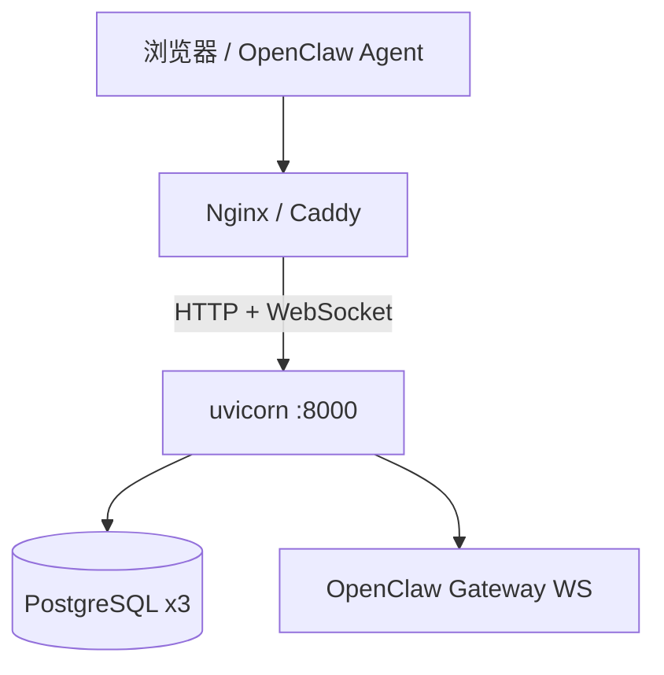

# 服务器部署指南

本文档面向 **Linux 云主机 / 内网服务器 / 生产环境**，与 [deployment.md](deployment.md) 中的本地开发说明互补。假设你已有可 SSH 访问的服务器，并自行管理 PostgreSQL（本仓库不捆绑数据库安装）。

## 部署架构概览



推荐形态：**单体部署** — 预构建 React SPA 由 FastAPI 静态挂载，单进程监听 `8000`，前置反向代理处理 TLS 与 WebSocket 升级。

> **Android 内测 APK** 请在开发机编译，勿在云服务器安装 Android SDK。见 [android-app.md](android-app.md)。

## 前置条件

| 项目 | 要求 |
|------|------|
| 操作系统 | Ubuntu 22.04+ / Debian 12+ / 同类 Linux |
| Python | 3.11+（Docker 方案内置 3.12） |
| Node.js | 仅源码构建前端时需要 20+ |
| PostgreSQL | 14+，三个独立库（可同机不同库名） |
| 网络 | 服务器可访问 OpenClaw Gateway（`OPENCLAW_OPENCLAW_WS_URL`） |

## 方式一：Docker（推荐）

适合快速上线、环境隔离、与 CI 产物一致。

### 一键：应用 + PostgreSQL

```bash
git clone <repo-url> /opt/openclaw_news_publisher
cd /opt/openclaw_news_publisher
bash scripts/deploy/one-click-docker.sh
```

脚本自动写入 Docker 用 `.env`、构建镜像、启动三库 PostgreSQL 并等待 `/healthz/db` 就绪。

### 手动：外部数据库或自定义配置

```bash
cp .env.example .env
# 编辑 .env：三库 DSN、API Key、Gateway WS 地址
```

生产环境注意：

```env
OPENCLAW_PRODUCTION=true
OPENCLAW_OPENCLAW_API_KEY=<强随机密钥，>=16 字符>
OPENCLAW_OPENCLAW_HMAC_SECRET=<强随机密钥，>=16 字符>
OPENCLAW_OPENCLAW_ENABLE_SIGNATURE=true
OPENCLAW_GIT_AUTO_PUSH=false
OPENCLAW_PORTAL_EMBED_API_KEY_IN_SPA=false
OPENCLAW_EXPOSE_OPENAPI=false
OPENCLAW_CORS_ORIGINS=          # 单体部署可留空
OPENCLAW_SERVE_SPA=true
OPENCLAW_OPENCLAW_WS_URL=ws://127.0.0.1:18789/ws
OPENCLAW_TRUST_X_FORWARDED_FOR=true   # 仅当反代可信且需按真实 IP 限流时
# Gateway 权限隔离（P0）— 见 docs/security/GATEWAY_ISOLATION.md
OPENCLAW_GATEWAY_STATE_DIR=/opt/openclaw-admin-state
OPENCLAW_GATEWAY_PORTAL_STATE_DIR=/opt/openclaw-portal-state
OPENCLAW_GATEWAY_PORTAL_AGENT_ID=portal-readonly
OPENCLAW_GATEWAY_ADMIN_AGENT_ID=main
OPENCLAW_CHAT_ENABLED_FOR_USER=true
```

门户写操作（bulk-delete、工作流诊断等）通过浏览器访问时，前端会先 `POST /api/v1/public/auth/session`（携带 `X-Api-Key`）换取 **HttpOnly Cookie**，后续请求自动 `credentials: include`；Agent 直连仍使用 `X-Api-Key` 头。

使用 Compose 内 PostgreSQL 时可复制 `scripts/deploy/env.docker.example` 为 `.env`。

```bash
docker compose --profile full up -d --build
```

仅应用容器、数据库由外部托管：

```bash
docker compose up app -d
```

### 3. 验证

```bash
curl -s http://127.0.0.1:8000/healthz
curl -s http://127.0.0.1:8000/healthz/db
```

浏览器访问 `http://<服务器IP>:8000/` 应看到 SPA 首页（对话界面）。

**Gateway 隔离验收**（P0，详见 [security/GATEWAY_ISOLATION.md](security/GATEWAY_ISOLATION.md)）：

```bash
# Gateway 仅监听回环（在 Gateway 宿主机执行）
ss -tlnp | grep 18789   # 期望 127.0.0.1:18789

# Docker 未暴露 18789
docker compose ps       # app 仅映射 8000

# 生产 env 已配置 portal 受限 device
grep OPENCLAW_GATEWAY_PORTAL_STATE_DIR .env
```

### 4. 更新发布

```bash
git pull
docker compose build --no-cache app
docker compose up -d app
```

## 方式二：裸机 + systemd

适合已有 Python 运维体系、不引入 Docker 的场景。

### 1. 系统依赖

```bash
sudo apt update
sudo apt install -y python3 python3-venv python3-pip git libpq5
# 构建前端时额外安装
sudo apt install -y nodejs npm   # 或 nvm 安装 Node 22
```

### 2. 部署用户与目录

```bash
sudo useradd -r -m -d /opt/openclaw -s /usr/sbin/nologin openclaw || true
sudo mkdir -p /opt/openclaw_news_publisher
sudo chown -R $USER:$USER /opt/openclaw_news_publisher
```

将代码同步到 `/opt/openclaw_news_publisher`（`git clone` 或 rsync）。

### 3. 安装应用

```bash
cd /opt/openclaw_news_publisher
python3 -m venv .venv
source .venv/bin/activate
pip install --upgrade pip
pip install -e .

cp .env.example .env
# 编辑 .env（见下文「环境变量」）

# 构建前端静态资源
cd frontend && npm ci && npm run build && cd ..
```

或使用一键脚本（不含 PostgreSQL）：

```bash
bash scripts/deploy/one-click-linux.sh
# 脚本会创建 venv、安装依赖并后台启动；生产前仍需 npm run build 与 systemd
```

### 4. systemd 服务单元

创建 `/etc/systemd/system/openclaw-news-publisher.service`：

```ini
[Unit]
Description=OpenClaw News Publisher
After=network.target postgresql.service
Wants=network-online.target

[Service]
Type=simple
User=openclaw
Group=openclaw
WorkingDirectory=/opt/openclaw_news_publisher
EnvironmentFile=/opt/openclaw_news_publisher/.env
ExecStart=/opt/openclaw_news_publisher/.venv/bin/uvicorn app.main:app \
  --host 0.0.0.0 --port 8000 --workers 2
Restart=on-failure
RestartSec=5
# 安全加固（按需调整）
NoNewPrivileges=true
ProtectSystem=strict
ReadWritePaths=/opt/openclaw_news_publisher

[Install]
WantedBy=multi-user.target
```

```bash
sudo chown -R openclaw:openclaw /opt/openclaw_news_publisher
sudo systemctl daemon-reload
sudo systemctl enable --now openclaw-news-publisher
sudo systemctl status openclaw-news-publisher
```

查看日志：`journalctl -u openclaw-news-publisher -f`

> **workers 说明**：WebSocket 对话（`/api/v1/chat/ws`）与内存 `chat_run_store` 在多 worker 下 **不共享状态**；小规模部署建议 `--workers 1`，或后续将 run 状态外置到 Redis/DB。另可在前置代理层做 WS 粘性。

## 方式三：Nginx 反向代理 + TLS

对外暴露 `443`，内网反代到 `127.0.0.1:8000`。

### Nginx 示例

`/etc/nginx/sites-available/openclaw.conf`：

```nginx
upstream openclaw_backend {
    server 127.0.0.1:8000;
    keepalive 32;
}

server {
    listen 80;
    server_name portal.example.com;
    return 301 https://$host$request_uri;
}

server {
    listen 443 ssl http2;
    server_name portal.example.com;

    ssl_certificate     /etc/letsencrypt/live/portal.example.com/fullchain.pem;
    ssl_certificate_key /etc/letsencrypt/live/portal.example.com/privkey.pem;

    client_max_body_size 20m;

    location / {
        proxy_pass http://openclaw_backend;
        proxy_http_version 1.1;
        proxy_set_header Host $host;
        proxy_set_header X-Real-IP $remote_addr;
        proxy_set_header X-Forwarded-For $proxy_add_x_forwarded_for;
        proxy_set_header X-Forwarded-Proto $scheme;
    }

    # WebSocket：首页对话与工作流诊断
    location /api/v1/chat/ws {
        proxy_pass http://openclaw_backend;
        proxy_http_version 1.1;
        proxy_set_header Upgrade $http_upgrade;
        proxy_set_header Connection "upgrade";
        proxy_set_header Host $host;
        proxy_read_timeout 86400;
    }
}
```

```bash
sudo ln -s /etc/nginx/sites-available/openclaw.conf /etc/nginx/sites-enabled/
sudo nginx -t && sudo systemctl reload nginx
```

TLS 证书可用 [Certbot](https://certbot.eff.org/)：`sudo certbot --nginx -d portal.example.com`

### Caddy 简例

```caddy
portal.example.com {
    reverse_proxy 127.0.0.1:8000
}
```

Caddy 默认自动 HTTPS；WebSocket 无需额外配置。

## PostgreSQL 三库

可在同一 PostgreSQL 实例上创建三个库，或使用托管 RDS。

```bash
sudo -u postgres psql <<'SQL'
CREATE USER openclaw_app WITH PASSWORD 'CHANGE_ME';
CREATE DATABASE openclaw_app OWNER openclaw_app;

CREATE USER openclaw_monitor WITH PASSWORD 'CHANGE_ME';
CREATE DATABASE openclaw_monitor OWNER openclaw_monitor;

CREATE USER openclaw_news WITH PASSWORD 'CHANGE_ME';
CREATE DATABASE openclaw_news OWNER openclaw_news;
SQL
```

报告主库需预建 `reports` 表，监测库与新闻库表由服务首次访问时自动创建。建表 SQL 见 [deployment.md#postgresql-三库](deployment.md#postgresql-三库)。

连通性检查（在应用目录）：

```bash
bash scripts/local/verify-openclaw-databases.sh
```

## 环境变量（生产）

完整列表见 [`.env.example`](../.env.example)。生产环境重点：

| 变量 | 说明 |
|------|------|
| `OPENCLAW_JWT_SECRET` | JWT 密钥，生产 **≥32 字符** |
| `OPENCLAW_LEGACY_API_KEY_ENABLED` | 全局 Key 过渡（**默认 false**） |
| `OPENCLAW_OPENCLAW_API_KEY` | Legacy 开启时映射 ADMIN；`OPENCLAW_PRODUCTION=true` 时仍校验强度 |
| `OPENCLAW_DATABASE_URL` | 报告主库 DSN（含 users/sessions/api_keys） |
| `OPENCLAW_MONITORING_DATABASE_URL` | 价格监测库 DSN |
| `OPENCLAW_NEWS_DATABASE_URL` | 新闻库 DSN |
| `OPENCLAW_OPENCLAW_WS_URL` | Gateway WebSocket（内网地址） |
| `OPENCLAW_BIND_HOST` | 通常 `0.0.0.0` |
| `OPENCLAW_BIND_PORT` | 默认 `8000` |
| `OPENCLAW_SERVE_SPA` | 生产保持 `true` |
| `OPENCLAW_CORS_ORIGINS` | 单体部署留空；前后端分离时再填前端域名 |
| `OPENCLAW_PRODUCTION` | 生产设为 `true`，启用 fail-fast（强密钥、HMAC、禁 git_auto_push 等） |
| `OPENCLAW_EXPOSE_OPENAPI` | 生产保持 `false`（默认已关，`/docs` 404） |
| `OPENCLAW_TRUST_X_FORWARDED_FOR` | 反代后按 `X-Forwarded-For` 限流时设为 `true` |
| `OPENCLAW_WS_MESSAGES_PER_MINUTE` | WebSocket 单连接 `user_message` 限速（默认 12/分钟） |
| `OPENCLAW_CHAT_RECV_TIMEOUT_SECONDS` | 对话 Gateway 空闲超时（默认 120 秒） |
| `OPENCLAW_CHAT_TOTAL_TIMEOUT_SECONDS` | 对话单轮总超时（默认 600 秒） |

`.env` 权限建议：`chmod 600 .env`，仅运行用户可读。Docker 镜像以非 root 用户 `appuser`（uid 10001）运行。

本地备份目录 `backups/` 仅用于运维快照（见 `backups/README.md`），**禁止**将含密钥的 `.env` 或数据库转储提交到版本库。

## OpenClaw Agent 侧配置

部署完成后，在运行 OpenClaw 的机器上配置：

- **入站 API**：`https://portal.example.com/api/v1/...`（或内网 `http://<ip>:8000`）
- **API Key**：在门户 **账户** 页为每个用户/Agent **单独生成** per-user Key；请求头 `X-Api-Key`
- **Public 读**：`GET /api/v1/public/*` 亦须带同一 per-user Key 或 Bearer JWT
- **Legacy 全局 Key**：默认已关闭（`OPENCLAW_LEGACY_API_KEY_ENABLED=false`）
- **价格入库**：`POST /api/v1/openclaw/monitoring/{id}/observations/ingest`
- **报告入站**：`POST /api/v1/openclaw/reports`（见 [api/openclaw-intake.md](api/openclaw-intake.md)）

**Skill 部署**（挂载仓库根目录 `skills/` 到 OpenClaw Gateway）：见 [openclaw-skills-deploy.md](openclaw-skills-deploy.md)。  
鉴权约定：`skills/_shared/multi-user-auth.md`

## 防火墙与安全

```bash
# 仅开放 80/443，应用端口不对外
sudo ufw allow OpenSSH
sudo ufw allow 'Nginx Full'
sudo ufw enable
```

建议：

1. 公网不要直接暴露 `:8000`，经反向代理访问。
2. 限制管理类端点（如 bulk-delete）的源 IP（Nginx `allow`/`deny`）。
3. 定期轮换各用户的 **per-user API Key**（门户账户页撤销/重建）。
4. PostgreSQL 仅监听内网或 `127.0.0.1`。

## 健康检查与监控

| 端点 | 用途 |
|------|------|
| `GET /healthz` | 进程存活 |
| `GET /healthz/db` | 三库连通 |
| `GET /docs` | OpenAPI（默认关闭；开发可设 `OPENCLAW_EXPOSE_OPENAPI=true`） |

可配置负载均衡或监控系统定时请求 `/healthz`。

## 故障排查

| 现象 | 排查 |
|------|------|
| 首页对话「连接中」 | 检查 Gateway 地址、Nginx WebSocket 配置、`journalctl` 日志 |
| 切页后回复不完整 | 确认已部署后台 run；`GET /api/v1/chat/runs/active`；见 [portal-chat.md](portal-chat.md) |
| 重启 app 后对话轮询 404 | `chat_run_store` 为内存态，进行中任务不可恢复 |
| `healthz/db` 失败 | 核对 DSN、防火墙、PostgreSQL `pg_hba.conf` |
| 静态页 404 | 确认 `frontend/dist` 存在且 `OPENCLAW_SERVE_SPA=true` |
| Agent 401 | per-user Key 无效/已撤销；Legacy 关闭时全局 Key 不可用 |
| Docker 构建失败 | 检查 `frontend/package-lock.json` 与 Node 版本 |

应用日志：

- systemd：`journalctl -u openclaw-news-publisher -f`
- Docker：`docker compose logs -f app`
- 本地脚本：`/tmp/openclaw_news_publisher.server.log`

## 发布检查清单

- [ ] 三库 DSN 已配置且 `verify-openclaw-databases.sh` 通过
- [ ] `OPENCLAW_PRODUCTION=true` 且强 JWT / HMAC / `GIT_AUTO_PUSH=false` 已通过启动校验
- [ ] `OPENCLAW_LEGACY_API_KEY_ENABLED=false`（或已迁移全部 Agent 至 per-user Key）
- [ ] 门户 ADMIN 可登录（默认 `admin@localhost` / `Test_648.`，**生产须尽快改密**）；测试用户可登录 `/account` 生成 Key
- [ ] `GET /docs` 返回 404（生产不暴露 OpenAPI）
- [ ] `frontend/dist` 已构建（Docker 或 `npm run build`）
- [ ] `curl /healthz` 与 `/healthz/db` 正常
- [ ] 反向代理 + TLS 已配置
- [ ] **Gateway 隔离**：`portal-readonly` Agent、`openclaw-portal-state`、`.env` 中 `OPENCLAW_GATEWAY_PORTAL_STATE_DIR`（见 [security/GATEWAY_ISOLATION.md](security/GATEWAY_ISOLATION.md)）
- [ ] `ufw deny 18789/tcp`；Docker **未** publish 18789
- [ ] USER 复测：问「我是否是管理员」不应回答 Gateway admin
- [ ] WebSocket 对话可连接；切页后后台生成与轮询正常（见 [portal-chat.md](portal-chat.md)）
- [ ] OpenClaw Agent 可成功 POST 报告/价格观测
- [ ] 防火墙仅开放必要端口

## 相关文档

- [deployment.md](deployment.md) — 本地开发与快速验证
- [android-app.md](android-app.md) — Android 内测 APK（Capacitor，本机构建）
- [architecture.md](architecture.md) — 系统架构与数据流
- [portal-chat.md](portal-chat.md) — 门户对话与后台 run
- [developer-guide.md](developer-guide.md) — 模块说明与开发规范
- [security/GATEWAY_ISOLATION.md](security/GATEWAY_ISOLATION.md) — Gateway 权限隔离（P0）
