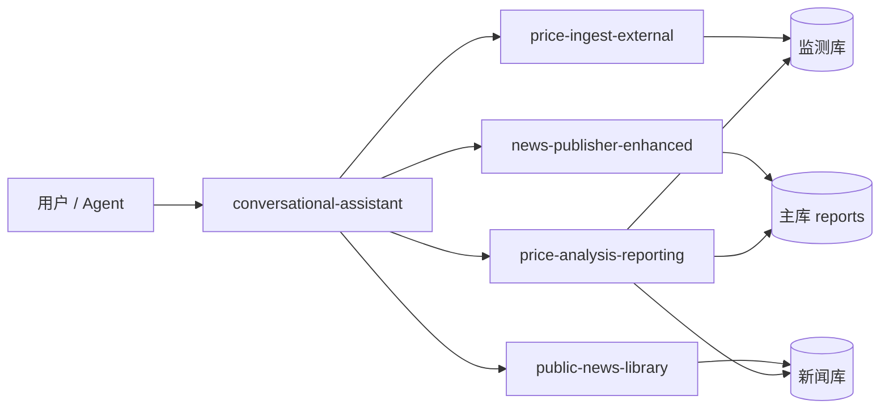

# OpenClaw Skills 架构重构计划

**版本**：2026-06-06  
**范围**：仅 Skill 层架构分析与迁移路线；不涉及数据库、后端代码修改。  
**目标**：构建长期可维护的多用户 SaaS Skill 架构，优先保障隔离、鉴权与内容安全。

---

## Current Architecture

### 技能职责树

```
OpenClaw Agent / Cursor
│
├── openclaw-conversational-assistant          [对话入口 · 意图路由 · API 编排]
│   ├── references/api-quickref.md
│   └── 委派 ↓
│
├── 数据采集层
│   ├── openclaw-price-ingest-external         [外采价格 → observations/ingest]
│   ├── openclaw-news-publisher-enhanced       [新闻爬虫 + POST reports + 监测 API 索引]
│   └── openclaw-public-news-library           [新闻库 CRUD + 联动触发]
│
├── 分析发布层
│   └── openclaw-price-analysis-reporting      [价格×新闻联合分析 + 报告入站]
│
├── 共享约定层 _shared/
│   └── multi-user-auth.md                     [鉴权 · 数据隔离 · 禁止假设]
│
└── （规划新增）
    ├── openclaw-user-workspace                [用户资源管理]
    ├── openclaw-report-security               [发布前安全校验]
    ├── report-schema.md                       [统一报告结构]
    ├── ownership-policy.md                    [资源归属策略]
    └── report-security.md                     [报告安全策略]
```

### 数据流总览



### 凭证与边界

| 边界 | 机制 |
|------|------|
| 用户隔离 | per-user `X-Api-Key` / JWT → `QueryContext.user_id` |
| 跨用户访问 | 返回 **404**（非 403），隐藏资源存在性 |
| 门户聊天 | WebSocket 不内置 API 工具；业务写操作需 Cursor Skill 或门户页面 |
| Legacy | 全局 `OPENCLAW_OPENCLAW_API_KEY` 过渡期映射 ADMIN |

---

## Responsibility Analysis

### openclaw-conversational-assistant

| 维度 | 内容 |
|------|------|
| **职责** | 自然语言入口；意图解析；写操作确认；API 速查；专项 Skill 委派 |
| **输入** | 用户自然语言、`BASE_URL`、per-user API Key |
| **输出** | API 调用结果回执、`monitor_id` / `ingest_id` / `job_name` |
| **API** | bootstrap、external-configs、timeseries、news-trigger、workflow/state 等 |
| **数据依赖** | 监测库、主库、新闻库（只读为主）；工作流配置表 |
| **安全风险** | 门户聊天无内置工具易被用户误解为「已执行」；写操作若跳过确认可误改他人 scope 内资源（Key 正确时仅限本用户）；不可代操 API Key 生成 |

### openclaw-news-publisher-enhanced

| 维度 | 内容 |
|------|------|
| **职责** | 新闻爬虫、白名单维护、报告 JSON 组装、`POST /openclaw/reports`、监测 API 大全 |
| **输入** | keyword、seed URLs、用户 API Key、可选 monitor 上下文 |
| **输出** | `report_payload.json`、`ingest_id`、轮询状态 |
| **API** | `POST /openclaw/reports`、`GET /openclaw/reports/{id}`、监测 bootstrap/ingest/public 读 |
| **数据依赖** | 主库（reports）、监测库；本地 `whitelist.json` / `seed_urls.json` |
| **安全风险** | 爬虫可访问任意外网 URL（SSRF 风险在 Agent 侧）；报告 JSON 若未校验可含 `javascript:` URL；本地白名单无用户隔离（多用户共用技能目录时配置泄露） |

### openclaw-price-ingest-external

| 维度 | 内容 |
|------|------|
| **职责** | 客户端价格采集 → `observations/ingest`；bootstrap；heartbeat |
| **输入** | `monitor_id` 或 `keyword`、数据源 URL、CNY 换算规则 |
| **输出** | `observation_id`、校验读数 |
| **API** | bootstrap、ingest、public observations/timeseries、external-heartbeat |
| **数据依赖** | 监测库 |
| **安全风险** | 禁止编造价格；`raw_payload` 不得含 API Key；无节制重试 |

### openclaw-public-news-library

| 维度 | 内容 |
|------|------|
| **职责** | 新闻库写入/查询、去重治理、与价格分析联动触发 |
| **输入** | keyword、summary、source_url 等 |
| **输出** | 库记录、联动上下文（keyword、monitor_id、news_hours） |
| **API** | `POST /openclaw/news/library`、`GET /public/news/library`、bulk-delete |
| **数据依赖** | 新闻库 |
| **安全风险** | 禁止编造 `source_url`；bulk-delete 须归属校验 |

### openclaw-price-analysis-reporting

| 维度 | 内容 |
|------|------|
| **职责** | 多窗口价格+新闻+历史报告联合分析；路径 A（news-trigger）/ 路径 B（深度分析 + POST） |
| **输入** | `monitor_id`、`keyword`、window_days、news_hours、horizon |
| **输出** | 结构化 `analysis`、报告 JSON、`ingest_id` |
| **API** | public monitoring/news/reports 读；`POST /openclaw/reports`；`POST /analysis/news-trigger` |
| **数据依赖** | 三库 |
| **安全风险** | 预测性输出非投资建议；数据不足时禁止强结论；`analysis` 可达 50k 字符需防注入 |

### _shared/multi-user-auth.md

| 维度 | 内容 |
|------|------|
| **职责** | 统一 per-user Key、JWT、Legacy 过渡说明；404 隔离语义 |
| **输入** | — |
| **输出** | Agent 鉴权行为约束 |
| **API** | 全站 `X-Api-Key` / Bearer 约定 |
| **数据依赖** | 用户表、api_keys 表 |
| **安全风险** | 禁止 Key 写入 Git/聊天；禁止假设 public 无鉴权 |

---

## Duplicate Responsibilities

### 重复鉴权逻辑

| 位置 | 重复内容 |
|------|----------|
| 全部 5 个业务 Skill §0 | 各自复述 per-user Key、`GET /public/*` 须带 Key、monitor 归属 |
| news-publisher-enhanced §8.6 | 再次完整列出监测 API 鉴权（与 price-ingest 高度重叠） |
| price-analysis-reporting §1.2 | 再次说明 BASE_URL + API_KEY + X-Request-Id |
| conversational-assistant §1 + §5 | 与 multi-user-auth 部分重叠 |

**建议**：保留 `_shared/multi-user-auth.md` 为唯一鉴权源；各 Skill 仅保留一行引用 + 本 Skill 特例外（如 JWT-only 端点）。

### 重复 schema

| 位置 | 重复内容 |
|------|----------|
| news-publisher-enhanced §5.1 | `OpenClawReportIn` 字段表 |
| price-analysis-reporting §7 | 同 schema + items 填充建议 |
| news-publisher-enhanced §8.1–8.2 | POST/GET reports 流程 |
| price-analysis-reporting §4.4 | 再次描述发布与轮询 |

**建议**：统一到 `_shared/report-schema.md`；发布流程由 `openclaw-report-security` 负责发布前校验清单。

### 重复 ownership 判断

| 位置 | 重复内容 |
|------|----------|
| multi-user-auth | monitor_id 须与 Key 配对；他人资源 404 |
| price-ingest §典型错误 | 404 Monitor not found |
| conversational-assistant §8 | 404 monitor 不属于当前用户 |
| news-publisher §0 | monitor_id 与 Key 一致 |

**建议**：统一到 `_shared/ownership-policy.md`；各 Skill 引用 + 本资源类型特例如 workflow job_name。

### 重复安全规则

| 位置 | 重复内容 |
|------|----------|
| 全部业务 Skill 开头 | 「三条安全准则」：测试请求≤3、禁止擅自改文件、失败停止 |
| news-publisher §10 | 禁止编造 URL |
| price-ingest §数据与网络 | 禁止编造价格 |
| price-analysis §11 | 不泄露 .env 与 Key |
| conversational-assistant §必须遵守 | 禁止编造数据、写操作确认、测试上限 |

**建议**：
- 通用 Agent 安全 → `_shared/agent-safety-baseline.md`（未来）
- 报告内容安全 → `_shared/report-security.md` + `openclaw-report-security`
- 各 Skill 保留 **本域特有风险**（爬虫 SSRF、价格造假、预测合规）

### 重复监测 API 文档

| 位置 | 内容 |
|------|------|
| news-publisher-enhanced §8.6 | 完整监测 API（~150 行） |
| price-ingest-external | bootstrap + ingest + heartbeat |
| price-analysis-reporting §4.1 | 读接口表 |
| api-quickref.md | 精简表 |

**建议**：监测写操作归 `price-ingest`；读操作归 `price-analysis` 或 future `openclaw-monitoring-read`；news-publisher 仅保留「报告发布」相关监测交叉引用。

---

## SaaS Gaps

### 用户工作区（Workspace）

| 现状 | 缺口 |
|------|------|
| 分散在 conversational-assistant 意图表与门户页面 | 无统一 Skill 管理「我的监测/报告/工作流/API Key/账户」 |
| Agent 需拼凑多个 GET | 缺少工作区级清单与导航回执模板 |

**规划**：`openclaw-user-workspace` Skill。

### 配额（Quota）

| 现状 | 缺口 |
|------|------|
| Rate limit 有服务端配置 | Skill 层未定义 per-user 配额语义（监测数、日报数、ingest 频率） |
| Agent 可无限 bootstrap | 无 Skill 级「配额耗尽」回执与降级策略 |

**规划**：未来 `_shared/quota-policy.md` + 服务端 `429` / `quota_exceeded` 响应对齐。

### Ownership

| 现状 | 缺口 |
|------|------|
| 服务端 `user_id` 列 + QueryContext | Skill 文档分散；POST body 无 `owner_user_id`（正确：服务端注入） |
| 报告 JSON 无 `monitor_id` 关联字段 | 联合分析后难以审计「报告属于哪条监测」 |

**规划**：`_shared/ownership-policy.md`；`report-schema.md` 增加可选 `monitor_id` 与响应侧 `owner_user_id`。

### Report Security

| 现状 | 缺口 |
|------|------|
| Pydantic 校验 URL scheme、字段长度 | Skill 层无统一发布前 XSS/URL/Markdown 检查清单 |
| 无独立「安全门」Skill | Agent 可能跳过校验直接 POST |

**规划**：`openclaw-report-security` + `_shared/report-security.md`。

### Report Schema

| 现状 | 缺口 |
|------|------|
| `OpenClawReportIn` 服务端模型 | Skill 间字段说明不一致；缺少 SaaS 视图（report_id、owner_user_id） |
| `task_id` vs `ingest_id` 命名混用 | Agent 易混淆幂等键与资源 ID |

**规划**：`_shared/report-schema.md` 定义统一语义层。

### Workspace 隔离（技能目录）

| 现状 | 缺口 |
|------|------|
| news-publisher 的 `whitelist.json` 在技能包内 | 多用户共用同一 OpenClaw 实例时，白名单偏好无 user_id |
| cron 环境变量全局 | `monitor_id` + Key 须手动配对，无工作区 manifest |

**规划**：用户级配置应存服务端或用户主目录，不应写入共享 Skill 包（文档约束，非代码改动）。

---

## Migration Plan

### 阶段 0 — 基线（当前任务）

- [x] 产出本计划文档
- [x] 新增 `_shared/report-schema.md`、`ownership-policy.md`、`report-security.md`
- [x] 新增 `openclaw-user-workspace`、`openclaw-report-security` Skill
- [x] 增强 `conversational-assistant` 的 Intent Routing Policy（仅追加）

**不实施**：后端改动、数据库迁移、现有 Skill 正文删除。

### 阶段 1 — 引用收敛（1–2 周）✅ 已完成（2026-06-06）

1. [x] 各业务 Skill 将 §0 鉴权改为引用 `_shared/multi-user-auth.md`（单行 + 特例）。
2. [x] 报告相关章节改为引用 `_shared/report-schema.md`，删除重复字段表（保留爬虫/分析特例如 items 填充）。
3. [x] 发布流程统一：先委派 `openclaw-report-security` 校验，再 `POST /openclaw/reports`。
4. [x] `conversational-assistant` §10 Intent Routing 为唯一路由真源；§2 指向 §10。
5. [x] `news-publisher-enhanced` §8.6 监测 API 收敛为交叉引用。

### 阶段 2 — 入口与工作区（2–4 周）✅ 已完成（2026-06-06）

1. [x] `conversational-assistant` §11 默认调度流水线。
2. [x] 「我的 xxx」→ `openclaw-user-workspace`（§10/§11 + user-workspace 门户引导表）。
3. [x] [`_shared/portal-chat-routing.md`](_shared/portal-chat-routing.md) 门户只读/写操作分流。

### 阶段 3 — 安全硬化（公网部署前）✅ 已完成（2026-06-06）

1. [x] [`public-deploy-security.md`](_shared/public-deploy-security.md) 发布路径 A–E 注册 + `report-security` 强制门。
2. [x] `analysis` / `generated_title` HTML 禁令（report-security + report-security Skill）。
3. [x] 429 / 422 / bulk-delete UUID / `javascript:` URL 与服务端对齐及回执模板。
4. [x] [`agent-safety-baseline.md`](_shared/agent-safety-baseline.md) Prompt Injection 与各 Skill 安全节收敛。

### 阶段 4 — SaaS 能力补齐（需后端配合，仅文档预埋）✅ 已完成（2026-06-06）

1. [x] [`_shared/quota-policy.md`](_shared/quota-policy.md) — 监测/报告/ingest 等上限与回执。
2. [x] [`_shared/workspace-api-roadmap.md`](_shared/workspace-api-roadmap.md) — `owner_user_id` 响应、列表过滤、`workspace/summary`。
3. [x] 用户级爬虫配置 API 预埋（`user/crawler-config`）；`news-publisher` / conversational 引用迁移路线。
4. [x] [`openclaw-audit-events`](openclaw-audit-events/SKILL.md) — 审计 Skill + API 回退策略。

### 阶段 5 — 清理与度量 ✅ 已完成（2026-06-06）

1. [x] 精简 `conversational-assistant` §5、`price-analysis` §1.2/§11、`news-publisher` 自包含声明。
2. [x] [`CHANGELOG.md`](CHANGELOG.md)、[`VERSIONS.md`](VERSIONS.md)；各 Skill `skill_version: "2.0.0"`。
3. [x] [`_shared/ci-skill-regression.md`](_shared/ci-skill-regression.md) — A/B Key 矩阵与 pytest 门禁。

---

## 风险分析（公网部署优先）

| 风险 | 严重度 | 现状 | 缓解（Skill 层） |
|------|--------|------|------------------|
| 跨用户数据泄露 | **高** | 服务端 404 隔离已实现 | 统一 ownership-policy；禁止 Agent 猜测他人 UUID |
| API Key 泄露 | **高** | 门户不代生成 | 禁止 Key 入聊天/Git；回执脱敏 |
| XSS via 报告内容 | **高** | URL scheme 服务端校验 | report-security Skill 发布前扫描 analysis/items |
| Prompt injection | **高** | 门户有过滤 | 不把网页/新闻全文当指令；用户输入仅作数据 |
| SSRF（爬虫） | **中** | Agent 侧 urllib | 白名单域名；禁止 file:// 内网 IP（爬虫已有部分 deny） |
| 共享技能目录配置串户 | **中** | whitelist 无 user_id | 文档禁止多租户共写同一 SKILL_ROOT |
| 重复 POST 报告 | **中** | X-Request-Id 幂等 | report-security 校验 Request-Id |
| 编造价格/新闻 | **中** | 各 Skill 分散禁止 | ✅ `agent-safety-baseline.md` + 各 Skill 附加规则 |
| Legacy 全局 Key | **中** | 过渡 ADMIN | 部署关闭 LEGACY；Skill 标注废弃 |
| 配额耗尽 DoS | **低** | rate limit | ✅ `quota-policy.md` + 测试请求≤3 |

---

## 新增文件清单（阶段 0）

| 路径 | 说明 |
|------|------|
| `skills/SKILL_REFACTOR_PLAN.md` | 本文档 |
| `skills/_shared/report-schema.md` | 统一报告结构 |
| `skills/_shared/ownership-policy.md` | 资源归属策略 |
| `skills/_shared/report-security.md` | 报告安全策略 |
| `skills/openclaw-user-workspace/SKILL.md` | 用户工作区 Skill |
| `skills/openclaw-report-security/SKILL.md` | 报告安全门 Skill |

## 目标目录树（阶段 0 完成后）

```
skills/                          # 仓库根目录（权威路径）
├── SKILL_REFACTOR_PLAN.md
├── CHANGELOG.md                  [阶段 5]
├── VERSIONS.md                   [阶段 5]
├── _shared/
│   ├── multi-user-auth.md
│   ├── agent-safety-baseline.md
│   ├── portal-chat-routing.md
│   ├── public-deploy-security.md
│   ├── quota-policy.md           [阶段 4]
│   ├── workspace-api-roadmap.md  [阶段 4]
│   ├── ci-skill-regression.md    [阶段 5]
│   ├── report-schema.md
│   ├── ownership-policy.md
│   └── report-security.md
├── openclaw-conversational-assistant/
├── openclaw-user-workspace/
├── openclaw-report-security/
├── openclaw-audit-events/        [阶段 4]
├── openclaw-news-publisher-enhanced/
├── openclaw-price-ingest-external/
├── openclaw-price-analysis-reporting/
└── openclaw-public-news-library/

.cursor/skills -> ../skills/     # Cursor IDE 符号链接（非 Git 重复副本）
```

---

**迁移计划阶段 0–5 已全部完成（Skill 文档层）**。后续需 **后端实现** 时对照 `workspace-api-roadmap.md`、`quota-policy.md` 落地 API；发布前执行 `ci-skill-regression.md` 中的 pytest 门禁。

**Gateway 部署**：[`docs/openclaw-skills-deploy.md`](../docs/openclaw-skills-deploy.md)
