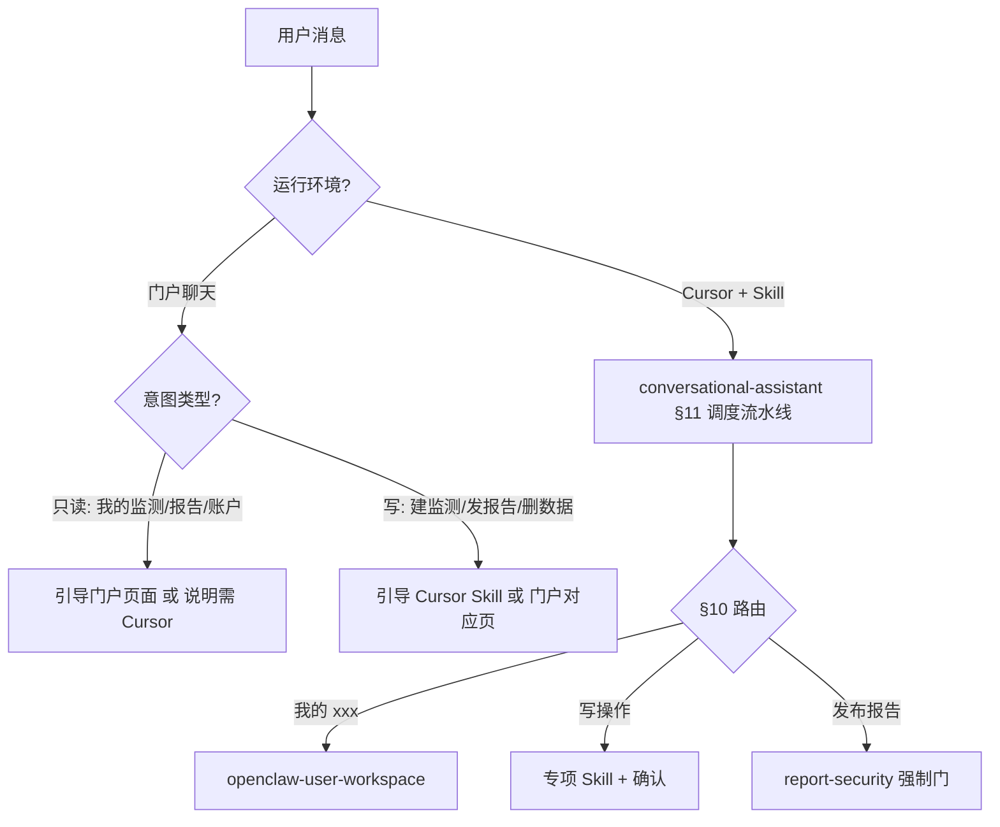

# 门户聊天与 Cursor 路由（OpenClaw Skills 共用）

**适用版本**：多用户 SaaS（2026-06 起）  
**目的**：明确 **门户 `/` 聊天** 与 **Cursor Agent** 的能力边界，避免用户误以为「在网页里说了就等于已执行」。

---

## 运行模式对比

| 维度 | 门户聊天 (`/`) | Cursor / OpenClaw Agent + Skill |
|------|----------------|----------------------------------|
| 传输 | WebSocket → OpenClaw Gateway | HTTP 工具 / `curl` / MCP |
| 凭证 | HttpOnly Refresh Cookie（已登录） | per-user `X-Api-Key` 或 Bearer |
| 内置 News Publisher API | **否** | **是**（启用 Skill 时） |
| 对话入口 Skill | 逻辑上仍属 `openclaw-conversational-assistant` | 同左，可实际调用 API |

---

## 意图分流（阶段 2 默认）



---

## 门户聊天：Agent 应答策略

### 只读类（可引导门户 UI）

用户意图为查看 **本人** 资源时，优先引导门户（无需 API Key 在 WS 中传递）：

| 用户说法 | 门户页面 | 说明 |
|----------|----------|------|
| 我的监测 / 关键词追踪 | **关键词追踪** | 列表、趋势图 |
| 我的报告 / 分析历史 | **报告** | 列表与详情 |
| 我的工作流 / 定时任务 | **工作流** | 外采配置与状态 |
| 我的新闻 | **新闻动态** | 新闻库联动 |
| 账户 / API Key | **账户** | Key 生成/撤销 **仅** 此页 |

可同时说明：「若要在 Cursor 中自动查询，请启用 `openclaw-user-workspace`。」

### 写操作类（须 Cursor 或门户页）

| 用户说法 | 门户 | Cursor |
|----------|------|--------|
| 创建监测、改 cron | 关键词追踪 / 工作流 表单 | `openclaw-price-ingest-external` 或本助手 §5 |
| 发布报告 | 工作流「运行分析」或受限 | `news-publisher` / `price-analysis` → **`report-security`** |
| 删除报告/新闻 | 列表勾选删除 | 本助手确认 → `bulk-delete` |
| 外采价格入库 | 无直接 WS 能力 | `openclaw-price-ingest-external` |

**门户 Agent 不得声称**「已为您 POST 成功」除非 Gateway 已配置 HTTP 工具且实际收到 2xx。

### 标准引导话术（写操作在门户被拒时）

```markdown
门户聊天当前无法直接调用发布服务 API。您可以：
1. 打开门户 → **{页面名}** 完成操作；或
2. 在 Cursor 中启用 OpenClaw Skill（`openclaw-conversational-assistant`），使用您的 API Key 执行。

API Key 在 **账户 → API Key 管理** 获取（仅显示一次，请勿粘贴到聊天）。
```

---

## Cursor：默认入口流水线

所有请求经 `openclaw-conversational-assistant` **§11 默认调度流水线**：

1. 解析意图 → §10 路由表  
2. 「我的 xxx」→ **`openclaw-user-workspace`**（无写确认）  
3. 写操作 → 确认 → 专项 Skill  
4. `POST /openclaw/reports` → 必先 **`openclaw-report-security`**

---

## 安全

- 门户已对明显违规/注入做前后端过滤；Agent **不得** 协助绕过。
- 门户聊天中 **禁止** 要求用户粘贴完整 API Key。
- 见 [`agent-safety-baseline.md`](agent-safety-baseline.md)、[`public-deploy-security.md`](public-deploy-security.md)。

---

## 相关文档

- `openclaw-conversational-assistant` §1、§10、§11
- `openclaw-user-workspace`
